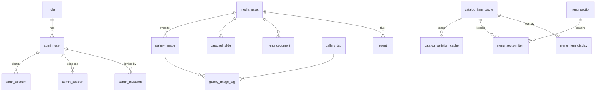

# TEAZO — Developer Build Guide

Everything you need to build against the TEAZO database and object storage.

Companion document: [`DATA-MODEL.md`](./DATA-MODEL.md) explains *why* the schema
looks like this. This document explains *how to use it*.

**Source of truth for the schema is [`teazo-site/migrations/0001_init.sql`](../teazo-site/migrations/0001_init.sql).**
If this guide and that file disagree, the file wins — tell whoever wrote this.

| | |
|---|---|
| Database | Cloudflare D1 (SQLite) — 26 tables, 31 indexes, 6 triggers |
| Object storage | Cloudflare R2 — bucket `teazo-media` |
| Catalog | Square API (authoritative — we cache it, we do not own it) |
| Status | Migrations written and validated locally. **Nothing deployed yet.** |

---

## Contents

1. [Before you write any code](#1-before-you-write-any-code)
2. [Connecting to D1 and R2](#2-connecting-to-d1-and-r2)
3. [The read path — getting data to the frontend](#3-the-read-path--getting-data-to-the-frontend)
4. [Object storage — how a file becomes a URL](#4-object-storage--how-a-file-becomes-a-url)
5. [Syncing Square into D1](#5-syncing-square-into-d1)
6. [Admin writes — the mutation contract](#6-admin-writes--the-mutation-contract)
7. [Auth and middleware](#7-auth-and-middleware)
8. [Table reference](#8-table-reference)
9. [Gotchas](#9-gotchas)
10. [Who builds what](#10-who-builds-what)

---

## 1. Before you write any code

### Two decisions are still open

**1. Where does this deploy?** The README says Vercel. D1 is a Workers/Pages
binding and **is not reachable from Vercel**. Options are in
[`DATA-MODEL.md` §2](./DATA-MODEL.md#blocker-1--d1-is-not-reachable-from-vercel).
This guide assumes **Cloudflare Workers via `@opennextjs/cloudflare`**.
Anything that changes under the Vercel + Turso alternative is marked
**[Workers-only]**.

**2. Nothing is deployed.** `wrangler.jsonc` has empty `database_id` fields and
the buckets do not exist. R2 is not even enabled on the account yet — it needs a
billing profile added in the dashboard first. Until someone runs the create
commands, `--local` is the only thing that works. That is fine: **you can build
almost everything against a local D1 file.**

### The one rule

> **Square owns the catalog. D1 owns a copy plus the curation Square cannot express.**

Never make a D1 column the editable source of truth for something Square owns —
item names, prices, variations, category membership and ordering, modifier rules,
sold-out state, online visibility, store hours. If an admin can edit it in our UI
*and* in the Square dashboard, the website and the register will disagree in front
of a customer.

What D1 legitimately owns is in [§5.1](#51-what-we-cache-vs-what-we-own).

---

## 2. Connecting to D1 and R2

### 2.1 First 15 minutes

Run everything from `teazo-site/`, not the repo root. Wrangler resolves
`wrangler.jsonc` and its local state directory relative to the working directory,
and getting this wrong leaves you with two different local databases.

```bash
git clone https://github.com/W-Sammy/Teazo-Site.git
cd Teazo-Site/teazo-site
npm install
```

```bash
npm install --save-dev wrangler@4
npm install @opennextjs/cloudflare
```

```bash
npx wrangler d1 migrations apply teazo-db --local
```

```bash
npx wrangler d1 execute teazo-db --local --command "SELECT day_of_week, display_text FROM business_hours ORDER BY day_of_week;"
```

That last command should print seven rows, Monday through Sunday, ending with
`11:00 AM - 8:00 PM`. If it does, your local database works. Everything after
this is plumbing that value into React.

Add to `.gitignore`:

```
# cloudflare
.dev.vars
.dev.vars.*
.wrangler/
.open-next/
```

### 2.2 Getting the bindings in code **[Workers-only]**

A binding is a **live object, not a string**. `env.DB` is a `D1Database` with
`.prepare()` on it. You cannot put it in `.env`, you cannot `JSON.stringify` it,
and it only exists inside a request.

Add to `next.config.ts` (the import goes *after* `export default` — it is a
side-effecting call, not a config value):

```ts
export default nextConfig;

import { initOpenNextCloudflareForDev } from "@opennextjs/cloudflare";
initOpenNextCloudflareForDev();
```

Then anywhere server-side:

```ts
// app/lib/db.ts
import { getCloudflareContext } from "@opennextjs/cloudflare";

export async function getDb() {
  const { env } = await getCloudflareContext({ async: true });
  return env.DB;
}

export async function getMedia() {
  const { env } = await getCloudflareContext({ async: true });
  return env.MEDIA;
}
```

Generate binding types so `env.DB` autocompletes:

```bash
npx wrangler types --env-interface CloudflareEnv cloudflare-env.d.ts
```

Secrets are not in `wrangler.jsonc`, so add them in a file the generator will
never overwrite:

```ts
// teazo-site/cloudflare-env.extra.d.ts
declare global {
  interface CloudflareEnv {
    /** app/lib/square.ts:9 */
    SQUARE_ACCESS_TOKEN: string;
    SQUARE_WEBHOOK_SIGNATURE_KEY: string;
  }
}
export {};
```

### 2.3 Secrets

| Where | How |
|---|---|
| Local dev | `teazo-site/.dev.vars` (gitignored), `KEY=value` per line |
| Deployed | `npx wrangler secret put SQUARE_ACCESS_TOKEN` |

Never commit a Square token. The repo's `.gitignore` already covers `.env*`;
`.dev.vars` is added above.

### 2.4 Useful scripts

Add to `package.json`:

```json
{
  "scripts": {
    "cf-typegen": "wrangler types --env-interface CloudflareEnv cloudflare-env.d.ts",
    "db:migrate:local": "wrangler d1 migrations apply teazo-db --local",
    "db:migrate:prod": "wrangler d1 migrations apply teazo-db --remote",
    "db:studio": "wrangler d1 execute teazo-db --local --command",
    "db:check": "wrangler d1 execute teazo-db --local --command \"PRAGMA foreign_key_check;\""
  }
}
```

There is deliberately no unsuffixed `db:migrate`. `--local` and `--remote` should
never be a typo apart.

### 2.5 The D1 API you will actually use

```ts
// Single row
const row = await db
  .prepare("SELECT * FROM business_profile WHERE id = 1")
  .first<BusinessProfile>();

// Many rows, with parameters (?1, ?2 — one-indexed)
const { results } = await db
  .prepare("SELECT * FROM gallery_image WHERE is_published = ?1 AND deleted_at IS NULL")
  .bind(1)
  .all<GalleryImageRow>();

// Write
const res = await db
  .prepare("UPDATE gallery_image SET name = ?1 WHERE id = ?2")
  .bind(name, id)
  .run();
res.meta.changes; // 0 means the row did not exist — check this

// Transaction — batch() is D1's ONLY transaction primitive.
// All-or-nothing. There are no interactive transactions and no stored procedures.
await db.batch([
  db.prepare("INSERT INTO media_asset (...) VALUES (...)").bind(...),
  db.prepare("INSERT INTO gallery_image (...) VALUES (...)").bind(...),
]);
```

**Limits that bite:** roughly 100 bound parameters and ~100 KB per statement.
A multi-row insert of the whole catalog does not fit in one statement — chunk it
(see [§5.4](#54-chunking-for-d1s-limits)).

---

## 3. The read path — getting data to the frontend

Every public page currently renders from a TypeScript literal. This section
replaces each one.

### 3.1 A typed query helper

```ts
// app/lib/queries.ts
import { getDb } from "./db";

export type BusinessProfile = {
  business_name: string;
  street_address: string;
  locality: string;
  phone: string | null;
  email: string | null;
  map_query: string;
};

export type BusinessHour = {
  day_of_week: number;   // 0 = Monday
  display_text: string;
  is_closed: number;
};

export type SiteLink = {
  key: string;
  link_group: "social" | "delivery" | "other";
  label: string;
  url: string;
  aria_label: string | null;
  sort_order: number;
};

const DAY_LABELS = ["Monday","Tuesday","Wednesday","Thursday","Friday","Saturday","Sunday"];
export const dayLabel = (d: number) => DAY_LABELS[d];

export async function getBusinessProfile() {
  const db = await getDb();
  return db.prepare("SELECT * FROM business_profile WHERE id = 1").first<BusinessProfile>();
}

export async function getBusinessHours() {
  const db = await getDb();
  const { results } = await db
    .prepare("SELECT day_of_week, display_text, is_closed FROM business_hours ORDER BY day_of_week")
    .all<BusinessHour>();
  return results;
}

export async function getSiteLinks(group: "social" | "delivery") {
  const db = await getDb();
  const { results } = await db
    .prepare(`SELECT key, link_group, label, url, aria_label, sort_order
                FROM site_link
               WHERE link_group = ?1 AND is_active = 1
               ORDER BY sort_order, key`)
    .bind(group)
    .all<SiteLink>();
  return results;
}
```

### 3.2 Per-page queries

| Page | Replaces | Query |
|---|---|---|
| `/contact` | `contact-content.ts:22-41` | `getBusinessProfile()` + `getBusinessHours()` + `getSiteLinks('social')` |
| `/delivery` | `delivery/page.tsx:70-72` | `getSiteLinks('delivery')` + two `content_block` rows |
| `/` | `page.tsx:109-122`, `image-carousel.tsx:7-13` | `getSiteLinks('social')` + carousel query below |
| `/gallery` | `gallery/page.tsx:18-28` | gallery query below |
| `/menu` | `menu/page.tsx:80-700` | menu query in [§3.3](#33-the-menu-query) |
| `/static-menu` | `static-menu-content.tsx:57` | `menu_document WHERE is_current = 1` |

Carousel:

```sql
SELECT cs.id, cs.alt, cs.caption, cs.link_url, ma.id AS media_id
  FROM carousel_slide cs
  JOIN media_asset ma ON ma.id = cs.media_id AND ma.deleted_at IS NULL
 WHERE cs.is_active = 1
 ORDER BY cs.sort_order, cs.id;
```

Public gallery:

```sql
SELECT gi.id, gi.name, gi.caption, gi.alt, ma.id AS media_id
  FROM gallery_image gi
  JOIN media_asset ma ON ma.id = gi.media_id AND ma.deleted_at IS NULL
 WHERE gi.is_published = 1 AND gi.deleted_at IS NULL
 ORDER BY gi.sort_order, gi.id;
```

### 3.3 The menu query

This is the only complicated one. Four tables, and the orphan rule matters.

```sql
SELECT
  ms.id            AS section_id,
  ms.title         AS section_title,
  ms.subtitle      AS section_subtitle,
  ms.sort_order    AS section_order,
  ci.square_object_id,
  ci.name          AS item_name,
  ci.description,
  ci.square_image_url,
  msi.position,
  mid.badge,
  mid.is_featured,
  mid.image_media_id
FROM menu_section ms
JOIN menu_section_item msi
  ON msi.section_id = ms.id AND msi.square_env = ms.square_env
JOIN catalog_item_cache ci
  ON ci.square_object_id = msi.square_catalog_object_id
 AND ci.square_env       = msi.square_env
LEFT JOIN menu_item_display mid
  ON mid.square_catalog_object_id = ci.square_object_id
 AND mid.square_env              = ci.square_env
WHERE ms.square_env    = ?1          -- 'sandbox' | 'production'
  AND ms.is_published  = 1
  AND ci.is_deleted    = 0            -- orphan rule: never render a dead item
  AND COALESCE(mid.hide_on_website, 0) = 0
ORDER BY ms.sort_order, ms.id, msi.position, ci.square_object_id;
```

Prices come from the variation table — an item can have several (Regular, Large):

```sql
SELECT square_object_id, square_variation_id, name, price_cents, currency, is_sold_out
  FROM catalog_variation_cache
 WHERE square_env = ?1 AND square_object_id IN (/* chunked */)
 ORDER BY square_object_id, ordinal;
```

Run those as two queries and stitch in JS. Do not try to do it in one — you get
a row per item×variation and have to de-duplicate anyway.

> **`ORDER BY` always ends with a tiebreak column.** `sort_order` is not unique,
> and without `, id` SQLite may return equal rows in a different order between
> requests, so the page visibly reshuffles.

### 3.4 Caching

A D1 read in a server component makes the route **dynamic**, which kills the
static generation these pages have today. Pick deliberately per route:

```ts
export const revalidate = 300; // /menu, /gallery, /contact — content changes rarely
```

Use `revalidate` for public pages and full dynamic only for `/admin`.

---

## 4. Object storage — how a file becomes a URL

This is the part people get wrong, so read it before writing upload code.

### 4.1 The rule: the database stores a key, never a URL

`media_asset` has `r2_bucket` and `r2_key` and deliberately **no `url` column**.

A URL is a *derived* value. It depends on which bucket, which custom domain, and
which serving strategy — all of which change independently of the file. Store an
absolute URL and every row rots the day you add a custom domain. Store the key
and the URL is a pure function you can change in one place.

```
media_asset row                          rendered
┌─────────────────────────────────┐
│ id        6f2c…9a1              │──▶  /api/media/6f2c…9a1
│ r2_bucket teazo-media           │
│ r2_key    gallery/2026/09/x.webp│      …which the serving route resolves to
│ mime_type image/webp            │      env.MEDIA.get("gallery/2026/09/x.webp")
│ byte_size 184320                │
└─────────────────────────────────┘
```

```ts
// app/lib/media.ts
export function toPublicUrl(mediaId: string) {
  return `/api/media/${mediaId}`;
}
```

One function. When you later put a custom domain in front of the bucket, you
change this function and nothing else.

### 4.2 Key layout

```
gallery/{yyyy}/{mm}/{uuid}.{ext}
menu/items/{square_object_id}/{uuid}.{ext}
carousel/{uuid}.{ext}
events/{event_id}/{uuid}.{ext}
documents/menu/{uuid}.pdf
branding/{uuid}.{ext}
```

UUID keys, not content hashes. Dedupe-by-checksum is a feature nobody asked for
and it makes "delete then re-upload the same file" fail on a unique index.

```ts
const EXT: Record<string, string> = {
  "image/jpeg": "jpg",
  "image/png": "png",
  "image/webp": "webp",
  "application/pdf": "pdf",
};

export function mintGalleryKey(mime: string, now = new Date()) {
  const yyyy = now.getUTCFullYear();
  const mm = String(now.getUTCMonth() + 1).padStart(2, "0");
  return `gallery/${yyyy}/${mm}/${crypto.randomUUID()}.${EXT[mime]}`;
}
```

### 4.3 The upload route **[Workers-only]**

```ts
// app/api/admin/gallery/route.ts
import { getCloudflareContext } from "@opennextjs/cloudflare";
import { requireAdmin } from "@/app/lib/auth";

const MAX_BYTES = 10 * 1024 * 1024;
const ALLOWED = ["image/jpeg", "image/png", "image/webp"] as const;

export async function POST(request: Request) {
  const admin = await requireAdmin(request, 2); // role 2 = Can Edit
  if (!admin) return Response.json({ error: "Unauthorized" }, { status: 401 });

  const { env } = await getCloudflareContext({ async: true });
  const form = await request.formData();
  const file = form.get("file");
  const name = String(form.get("name") ?? "").trim();
  const tags = JSON.parse(String(form.get("tags") ?? "[]")) as string[];

  if (!(file instanceof File)) return Response.json({ error: "file required" }, { status: 400 });
  if (!name) return Response.json({ error: "name required" }, { status: 400 });

  const bytes = await file.arrayBuffer();
  if (bytes.byteLength === 0)         return Response.json({ error: "empty file" }, { status: 400 });
  if (bytes.byteLength > MAX_BYTES)   return Response.json({ error: "file too large" }, { status: 413 });

  // Sniff magic bytes — do NOT trust File.type, it is client-supplied.
  const mime = sniffMime(new Uint8Array(bytes.slice(0, 16)));
  if (!mime || !ALLOWED.includes(mime as typeof ALLOWED[number])) {
    return Response.json({ error: "unsupported image type" }, { status: 415 });
  }

  const key = mintGalleryKey(mime);
  const mediaId = crypto.randomUUID();
  const imageId = crypto.randomUUID();

  // 1. Bytes first. If D1 fails after this, we leak one object — recoverable.
  //    If we wrote D1 first and R2 failed, we would have a row pointing at
  //    nothing, which breaks the page. Leak over dangle, always.
  await env.MEDIA.put(key, bytes, { httpMetadata: { contentType: mime } });

  // 2. Metadata, all-or-nothing.
  const stmts = [
    env.DB.prepare(
      `INSERT INTO media_asset
         (id, r2_bucket, r2_key, mime_type, byte_size, original_filename, purpose, uploaded_by)
       VALUES (?1, ?2, ?3, ?4, ?5, ?6, 'gallery', ?7)`
    ).bind(mediaId, env.MEDIA_BUCKET_NAME, key, mime, bytes.byteLength, file.name, admin.id),

    env.DB.prepare(
      `INSERT INTO gallery_image (id, media_id, name, name_sort_key)
       VALUES (?1, ?2, ?3, ?4)`
    ).bind(imageId, mediaId, name, sortKey(name)),
  ];

  for (const raw of tags) {
    const norm = normalizeTag(raw);
    if (!norm) continue;
    stmts.push(
      env.DB.prepare(
        `INSERT INTO gallery_tag (id, name, name_normalized) VALUES (?1, ?2, ?3)
         ON CONFLICT(name_normalized) DO NOTHING`
      ).bind(crypto.randomUUID(), raw.trim(), norm),
      env.DB.prepare(
        `INSERT INTO gallery_image_tag (image_id, tag_id)
         SELECT ?1, id FROM gallery_tag WHERE name_normalized = ?2`
      ).bind(imageId, norm)
    );
  }

  await env.DB.batch(stmts);

  return Response.json({ id: imageId, url: toPublicUrl(mediaId) }, { status: 201 });
}
```

Helpers:

```ts
// app/lib/media.ts
export const normalizeTag = (s: string) =>
  s.trim().replace(/\s+/g, " ").toLowerCase();

// gallery_image.name_sort_key — SQLite's collations cannot reproduce
// localeCompare, and our content is bilingual. Compute the key at write time.
export const sortKey = (s: string) =>
  s.normalize("NFKD").replace(/\p{Diacritic}/gu, "").toLowerCase().trim();

export function sniffMime(head: Uint8Array): string | null {
  if (head[0] === 0xff && head[1] === 0xd8) return "image/jpeg";
  if (head[0] === 0x89 && head[1] === 0x50) return "image/png";
  if (head[0] === 0x25 && head[1] === 0x50) return "application/pdf";
  if (String.fromCharCode(...head.slice(0, 4)) === "RIFF" &&
      String.fromCharCode(...head.slice(8, 12)) === "WEBP") return "image/webp";
  return null;
}
```

### 4.4 The serving route

```ts
// app/api/media/[id]/route.ts
import { getCloudflareContext } from "@opennextjs/cloudflare";

export async function GET(_req: Request, ctx: { params: Promise<{ id: string }> }) {
  const { id } = await ctx.params;
  const { env } = await getCloudflareContext({ async: true });

  const row = await env.DB
    .prepare("SELECT r2_key, mime_type FROM media_asset WHERE id = ?1 AND deleted_at IS NULL")
    .bind(id)
    .first<{ r2_key: string; mime_type: string }>();

  if (!row) return new Response("Not found", { status: 404 });

  const obj = await env.MEDIA.get(row.r2_key);
  if (!obj) return new Response("Not found", { status: 404 });

  return new Response(obj.body, {
    headers: {
      "Content-Type": row.mime_type,
      "Cache-Control": "public, max-age=31536000, immutable", // keys are immutable
      "ETag": obj.httpEtag,
    },
  });
}
```

Because keys are UUIDs and never reused, the response is safely immutable-cacheable.

### 4.5 Deletion — three steps, in this order

Media is **soft**-deleted, and a database trigger refuses to soft-delete a file
that is still referenced by a gallery image, carousel slide, menu document,
content block, site link, event flyer, menu item photo, or admin avatar.

Run an explicit usage check first so you can return a helpful error instead of
surfacing a raw constraint failure:

```ts
const inUse = await env.DB.prepare(
  `SELECT 'gallery' AS t FROM gallery_image      WHERE media_id = ?1 AND deleted_at IS NULL
   UNION ALL SELECT 'carousel' FROM carousel_slide WHERE media_id = ?1
   UNION ALL SELECT 'menu_pdf' FROM menu_document  WHERE media_id = ?1
   UNION ALL SELECT 'content'  FROM content_block  WHERE media_id = ?1
   UNION ALL SELECT 'link'     FROM site_link      WHERE icon_media_id = ?1
   UNION ALL SELECT 'event'    FROM event          WHERE flyer_media_id = ?1 AND deleted_at IS NULL
   UNION ALL SELECT 'menu_item' FROM menu_item_display WHERE image_media_id = ?1
   LIMIT 1`
).bind(mediaId).first<{ t: string }>();

if (inUse) {
  return Response.json(
    { error: "still_in_use", usedBy: inUse.t },
    { status: 409 }
  );
}

await env.DB.batch([
  env.DB.prepare("UPDATE gallery_image SET deleted_at = strftime('%Y-%m-%dT%H:%M:%fZ','now') WHERE id = ?1").bind(imageId),
  env.DB.prepare("UPDATE media_asset  SET deleted_at = strftime('%Y-%m-%dT%H:%M:%fZ','now') WHERE id = ?1").bind(mediaId),
  env.DB.prepare("INSERT INTO pending_r2_deletion (r2_bucket, r2_key) VALUES (?1, ?2)").bind(bucket, key),
]);
```

Note the gallery row is retired *before* the media row, or the trigger fires.

Bytes are **not** deleted here. A cron Worker drains the queue:

```ts
// Scheduled handler — add a [triggers] crons entry to wrangler.jsonc
export default {
  async scheduled(_e: ScheduledEvent, env: CloudflareEnv) {
    const { results } = await env.DB
      .prepare("SELECT id, r2_key FROM pending_r2_deletion WHERE deleted_at IS NULL LIMIT 100")
      .all<{ id: string; r2_key: string }>();

    for (const row of results) {
      try {
        await env.MEDIA.delete(row.r2_key);
        await env.DB.prepare(
          "UPDATE pending_r2_deletion SET deleted_at = strftime('%Y-%m-%dT%H:%M:%fZ','now') WHERE id = ?1"
        ).bind(row.id).run();
      } catch (err) {
        await env.DB.prepare("UPDATE pending_r2_deletion SET last_error = ?2 WHERE id = ?1")
          .bind(row.id, String(err)).run();
      }
    }
  },
};
```

> **The sweeper Worker needs an owner.** It drains this queue *and* expires
> `admin_session` and `admin_invitation` rows. D1 has no TTL and no scheduled
> jobs of its own — without this Worker, sessions never expire and dead bytes
> accumulate forever. It is small, and four correctness stories depend on it.

### 4.6 `next/image`

`next.config.ts` currently allowlists only the Square **sandbox** S3 bucket
(`app/lib/imageHosts.ts:2-4`). Since media is served from a same-origin route
(`/api/media/...`), no `remotePatterns` entry is needed for our own files — but
the Square host list still needs the production bucket at cutover.

> **[Workers-only] `sharp` does not run on workerd.** Next's image optimizer
> depends on it, so on the Workers path you must either set
> `images: { unoptimized: true }` or use a custom loader emitting Cloudflare
> Image Resizing URLs. This matters more than it sounds:
> `public/carousel_images/dried_leaves.jpg` is **8.1 MB** and would ship
> unresized to every home-page visitor. Resize the carousel images during the
> migration in §4.7 regardless.

### 4.7 Migrating existing assets

`public/` is 18 MB / 101 files. Split by **who owns the file**, not by type:

| Stays in repo | Moves to R2 |
|---|---|
| `admin_icons/` (14), `social_icons/` (4) | `menu_items/` — 65 `.webp`, 6.4 MB |
| `pdfjs/` (2, vendored) | `carousel_images/` — 5 files, 8.1 MB |
| logos, `pink_scribble.png` | `promotions/` (1), `teazo-menu.pdf` |

~14.7 MB migrates. Sketch:

```bash
# For each file: upload, then INSERT media_asset with the returned key.
npx wrangler r2 object put teazo-media/carousel/<uuid>.jpg \
  --file public/carousel_images/menu.jpg --content-type image/jpeg
```

Script it — 71 files by hand is a bad afternoon. Resize the carousel JPEGs
before upload.

---

## 5. Syncing Square into D1

### 5.1 What we cache vs what we own

| Square owns (cache only, never edit) | D1 owns (edit freely) |
|---|---|
| item name, description | section titles & subtitles |
| variations, prices, currency | the synthetic "TEAZO Special" section |
| category membership + `ordinal` | display `position` within a section |
| modifier lists, selection rules | local photo override, badges, featured |
| sold-out state, online visibility | allergen notes, hide-on-website |
| item images | everything non-catalog |

### 5.2 Prerequisite: fix the variations bug first

`PUT /api/square/products/[id]` (lines 90-104) rewrites `itemData.variations` to
a **single element named "Regular"**. `POST` does the same. Every admin edit
silently deletes all but the first size.

For a boba shop, sizes *are* the variations. **Do not build the sync until this
is fixed**, or the cache faithfully mirrors data corruption. The corrected
handler must read all variations, preserve each one's `id` and `version`, and
send them all back:

```ts
const currentVariations = (currentItem.itemData?.variations ?? []) as CatalogObject.ItemVariation[];

variations: currentVariations.map((v) => ({
  type: "ITEM_VARIATION" as const,
  id: v.id,
  version: v.version,
  itemVariationData: {
    ...v.itemVariationData,
    // apply only the edits the request actually asked for
  },
})),
```

Also **remove the `BigInt.prototype.toJSON` monkey-patch** in
`app/lib/square.ts:12-21`. It is a global side effect of an import, it is lossy,
and every price passes through it. Convert explicitly instead:

```ts
const toInt = (v?: bigint | number | null) => (v == null ? null : Number(v));
```

### 5.3 Full sync

```ts
// app/lib/square-sync.ts
export async function fullSync(env: CloudflareEnv) {
  const sqEnv = env.SQUARE_ENV; // 'sandbox' | 'production'
  const items = squareClient.catalog.list({ types: "ITEM" });

  const itemStmts: D1PreparedStatement[] = [];
  const varStmts: D1PreparedStatement[] = [];

  for await (const obj of items) {
    const item = obj as CatalogObject.Item;
    if (!item.id) continue;

    itemStmts.push(env.DB.prepare(
      `INSERT INTO catalog_item_cache
         (square_object_id, square_env, square_version, name, description,
          square_image_url, categories_json, is_deleted, synced_at)
       VALUES (?1,?2,?3,?4,?5,?6,?7,0, strftime('%Y-%m-%dT%H:%M:%fZ','now'))
       ON CONFLICT(square_object_id, square_env) DO UPDATE SET
         square_version   = excluded.square_version,
         name             = excluded.name,
         description      = excluded.description,
         square_image_url = excluded.square_image_url,
         categories_json  = excluded.categories_json,
         is_deleted       = 0,
         synced_at        = excluded.synced_at`
    ).bind(
      item.id, sqEnv, toInt(item.version),
      item.itemData?.name ?? null,
      item.itemData?.description ?? null,
      null,
      JSON.stringify((item.itemData?.categories ?? []).map((c) => ({ id: c.id, ordinal: toInt(c.ordinal) })))
    ));

    // EVERY variation, not just [0].
    for (const v of (item.itemData?.variations ?? []) as CatalogObject.ItemVariation[]) {
      if (!v.id) continue;
      const money = v.itemVariationData?.priceMoney;
      varStmts.push(env.DB.prepare(
        `INSERT INTO catalog_variation_cache
           (square_variation_id, square_env, square_object_id, square_version,
            name, price_cents, currency, ordinal, synced_at)
         VALUES (?1,?2,?3,?4,?5,?6,?7,?8, strftime('%Y-%m-%dT%H:%M:%fZ','now'))
         ON CONFLICT(square_variation_id, square_env) DO UPDATE SET
           name = excluded.name, price_cents = excluded.price_cents,
           currency = excluded.currency, ordinal = excluded.ordinal,
           synced_at = excluded.synced_at`
      ).bind(
        v.id, sqEnv, item.id, toInt(v.version),
        v.itemVariationData?.name ?? null,
        toInt(money?.amount), money?.currency ?? "USD",
        toInt(v.itemVariationData?.ordinal) ?? 0
      ));
    }
  }

  // Items before variations — the FK depends on the parent existing.
  for (const c of chunk(itemStmts, 20)) await env.DB.batch(c);
  for (const c of chunk(varStmts, 20)) await env.DB.batch(c);
}
```

### 5.4 Chunking for D1's limits

D1 allows ~100 bound parameters per statement. `catalog_item_cache` binds 7 per
row, so a batch of 20 statements is comfortably inside the limit with room for
the variation table's 8. Do not raise this above ~30 without measuring.

```ts
const chunk = <T,>(a: T[], n: number) =>
  Array.from({ length: Math.ceil(a.length / n) }, (_, i) => a.slice(i * n, i * n + n));
```

### 5.5 Delta sync and webhooks

Square emits exactly **one** catalog webhook, `catalog.version.updated`, and its
payload carries only the merchant's new catalog version — **it does not say which
objects changed.** So there is no object-level delta to key on. The design is:

1. Webhook arrives → verify the signature → read the new version.
2. Compare to `square_sync_state.last_catalog_version` for this `square_env`.
3. If newer, run a delta scan with `SearchCatalogObjects`, passing `beginTime`
   = `last_synced_at` and `includeDeletedObjects: true`.
4. Upsert live objects; mark returned tombstones `is_deleted = 1`.
5. Write the new watermark.

```ts
await env.DB.prepare(
  `INSERT INTO square_sync_state (key, square_env, last_catalog_version, last_synced_at)
   VALUES ('catalog', ?1, ?2, strftime('%Y-%m-%dT%H:%M:%fZ','now'))
   ON CONFLICT(key, square_env) DO UPDATE SET
     last_catalog_version = excluded.last_catalog_version,
     last_synced_at       = excluded.last_synced_at,
     last_error           = NULL`
).bind(sqEnv, newVersion).run();
```

### 5.6 Deletes and orphans

`DELETE /api/square/products/[id]` returns `deletedObjectIds` and currently
**consumes it nowhere**. It must mark the cache:

```ts
await env.DB.batch(
  deletedObjectIds.map((id) =>
    env.DB.prepare(
      "UPDATE catalog_item_cache SET is_deleted = 1 WHERE square_object_id = ?1 AND square_env = ?2"
    ).bind(id, sqEnv)
  )
);
```

Never hard-delete a cache row: `menu_section_item` and `menu_item_display`
reference it with `ON DELETE RESTRICT`, so `is_deleted` is the tombstone. The
menu query already filters `ci.is_deleted = 0`, so the item disappears from the
public page while the admin's curation survives if Square restores it.

> **A re-created Square item gets a new id**, so its curation is lost. That is
> inherent to keying on Square ids, and worth telling the client.

### 5.7 Sandbox → production cutover

`app/lib/square.ts:8` hardcodes `SquareEnvironment.Sandbox`. Read it from
`env.SQUARE_ENV` instead. Then:

1. Set the production Square token as a secret.
2. `INSERT INTO square_sync_state (key, square_env) VALUES ('catalog','production')`
   — `last_synced_at` NULL correctly forces a full initial sync.
3. Run `fullSync` against production. Sandbox rows are untouched: every key
   includes `square_env`.
4. Re-create menu sections and curation against production ids. **This is manual
   work** — sandbox and production share no object ids.
5. Add the production image host to `app/lib/imageHosts.ts`.
6. Flip `SQUARE_ENV`.

Cheapest if curation work starts *after* cutover.

---

## 6. Admin writes — the mutation contract

Every route below requires a valid session ([§7](#7-auth-and-middleware)).
Roles are `1 = Owner`, `2 = Can Edit`, `3 = Can View` — matching
`ADMIN_ROLE_LABELS` on the `steven-create-admins` branch.

### 6.1 Gallery

| Method | Path | Role | Effect |
|---|---|---|---|
| `GET` | `/api/admin/gallery` | 3 | list with search/tag filter/sort |
| `POST` | `/api/admin/gallery` | 2 | upload — see [§4.3](#43-the-upload-route-workers-only) |
| `PATCH` | `/api/admin/gallery/[id]` | 2 | rename, caption, alt, tags, publish |
| `DELETE` | `/api/admin/gallery/[id]` | 2 | soft-delete — see [§4.5](#45-deletion--three-steps-in-this-order) |

The list query mirrors what `admin-gallery-client.tsx` does today —
case-insensitive substring over **name and tags**, OR-semantics tag filter:

```sql
SELECT gi.*, ma.r2_key
  FROM gallery_image gi
  JOIN media_asset ma ON ma.id = gi.media_id
 WHERE gi.deleted_at IS NULL
   AND (?1 = '' OR lower(gi.name) LIKE '%' || lower(?1) || '%'
        OR EXISTS (SELECT 1 FROM gallery_image_tag git
                     JOIN gallery_tag gt ON gt.id = git.tag_id
                    WHERE git.image_id = gi.id
                      AND gt.name_normalized LIKE '%' || lower(?1) || '%'))
 ORDER BY gi.name_sort_key;   -- or created_at DESC, per the sort dropdown
```

`LIKE '%x%'` cannot use an index. At this table's size a scan is fine; if the
gallery grows past a few thousand rows, switch to FTS5.

**Renaming must recompute `name_sort_key`.** It is `NOT NULL` and the UI sorts
on it; forget this and the sort order silently stops matching the names.

### 6.2 Tag handling

Tags are a shared vocabulary with `name_normalized UNIQUE`. Always upsert:

```sql
INSERT INTO gallery_tag (id, name, name_normalized) VALUES (?1, ?2, ?3)
ON CONFLICT(name_normalized) DO NOTHING;

INSERT INTO gallery_image_tag (image_id, tag_id)
SELECT ?1, id FROM gallery_tag WHERE name_normalized = ?2
ON CONFLICT DO NOTHING;
```

This is what stops "Matcha" and "matcha" becoming two sidebar entries — the
current `normalizeTag` in `gallery-upload-form.tsx:31-33` trims and collapses
whitespace but does **not** lowercase.

### 6.3 Admins (Settings)

Matches the stub API on `steven-create-admins`
(`app/api/admin/settings/admins-api.ts`), which currently throws on every call.

| Method | Path | Role | Notes |
|---|---|---|---|
| `GET` | `/api/admin/settings/admins` | 1 | list |
| `POST` | `/api/admin/settings/admins` | 1 | create + invite |
| `PATCH` | `/api/admin/settings/admins/[id]/role` | 1 | change role |
| `PATCH` | `/api/admin/settings/admins/[id]/invite-permission` | 1 | toggle `can_invite_users` |
| `DELETE` | `/api/admin/settings/admins/[id]` | 1 | soft-delete + revoke sessions |

Rules the schema enforces, matching `use-admins.ts`:

- `can_invite_users = 1` is **only** valid for role 2. A CHECK constraint rejects
  anything else, so changing a role to 1 or 3 must clear the flag in the same
  statement.
- At most one Owner — a partial unique index. "At least one Owner" is **not**
  expressible in SQLite; your handler must refuse to delete or demote the last
  one (`use-admins.ts:21, :53-56`).
- `email_normalized` is unique among live rows. Normalize with
  `email.trim().toLowerCase()` — `addAdmin` currently does no duplicate check at
  all.

**Deleting an admin must revoke their sessions in the same batch.** The FK is
`ON DELETE CASCADE`, but we soft-delete, so the cascade never fires:

```ts
await env.DB.batch([
  env.DB.prepare("UPDATE admin_user SET deleted_at = strftime('%Y-%m-%dT%H:%M:%fZ','now') WHERE id = ?1").bind(id),
  env.DB.prepare("UPDATE admin_session SET revoked_at = strftime('%Y-%m-%dT%H:%M:%fZ','now') WHERE admin_user_id = ?1 AND revoked_at IS NULL").bind(id),
]);
```

### 6.4 Website content

| Method | Path | Role | Effect |
|---|---|---|---|
| `GET` | `/api/admin/content` | 3 | all blocks grouped by `page_key` |
| `PUT` | `/api/admin/content/[key]` | 2 | update one block |

`content_block.key` **must** equal `page_key || '.' || slot_key` — a CHECK
enforces it. Build the key, do not accept it from the client.

### 6.5 Menu curation

| Method | Path | Role | Effect |
|---|---|---|---|
| `PUT` | `/api/admin/menu/sections/[id]` | 2 | title, subtitle, order, publish |
| `PUT` | `/api/admin/menu/sections/[id]/items` | 2 | membership + `position` |
| `PUT` | `/api/admin/menu/items/[squareId]/display` | 2 | photo, badge, featured, hide |

These replace the `console.log` stubs in `admin-list-view.tsx:127-132`. Note the
overlay upsert must supply `square_env`:

```sql
INSERT INTO menu_item_display
  (square_catalog_object_id, square_env, image_media_id, badge, is_featured, updated_by)
VALUES (?1, ?2, ?3, ?4, ?5, ?6)
ON CONFLICT(square_catalog_object_id, square_env) DO UPDATE SET
  image_media_id = excluded.image_media_id,
  badge          = excluded.badge,
  is_featured    = excluded.is_featured,
  updated_by     = excluded.updated_by;
```

### 6.6 Events, hours, links, contact inbox

| Method | Path | Role |
|---|---|---|
| `GET/POST` `/api/admin/events`, `PUT/DELETE` `/api/admin/events/[id]` | 2 |
| `PUT` `/api/admin/hours` (bulk, 7 rows) | 2 |
| `POST/DELETE` `/api/admin/hours/exceptions` | 2 |
| `GET/PUT` `/api/admin/links` | 2 |
| `GET` `/api/admin/messages`, `PATCH` `/api/admin/messages/[id]` (mark read) | 3 |
| `POST` `/api/contact` | **public** |

`POST /api/contact` is the only route an unauthenticated visitor can write to.
Rate-limit it and cap field lengths — the table has no length constraints.

---

## 7. Auth and middleware

> **This is a live hole today.** There is no `middleware.ts` anywhere in the
> repo, `app/admin/layout.tsx` is pure presentation with no guard, and
> `POST`/`PUT`/`DELETE` on `/api/square/products` are unauthenticated routes that
> **write to the live Square catalog**. Anyone who knows the URLs can use them.
> Fix this in the same sprint as the tables.

### 7.1 Session validation

```ts
// app/lib/auth.ts
import { getCloudflareContext } from "@opennextjs/cloudflare";

export async function getSession(request: Request) {
  const token = parseCookie(request.headers.get("cookie"), "teazo_session");
  if (!token) return null;

  const { env } = await getCloudflareContext({ async: true });
  const id = await sha256Hex(token);

  // Joining admin_user and requiring active/undeleted means a missed
  // revocation still fails closed.
  return env.DB.prepare(
    `SELECT s.id, au.id AS admin_id, au.display_name, au.role_id, au.can_invite_users
       FROM admin_session s
       JOIN admin_user au ON au.id = s.admin_user_id
      WHERE s.id = ?1
        AND s.revoked_at IS NULL
        AND s.expires_at > strftime('%Y-%m-%dT%H:%M:%fZ','now')
        AND au.deleted_at IS NULL
        AND au.status = 'active'`
  ).bind(id).first<SessionRow>();
}

/** minRole: 1 = Owner, 2 = Can Edit, 3 = Can View. Lower id = more privilege. */
export async function requireAdmin(request: Request, minRole: 1 | 2 | 3) {
  const s = await getSession(request);
  return s && s.role_id <= minRole ? s : null;
}
```

Store only the **SHA-256 of the cookie value** as `admin_session.id`. A database
read never yields a usable token.

### 7.2 Middleware

```ts
// teazo-site/middleware.ts
import { NextResponse, type NextRequest } from "next/server";

export function middleware(req: NextRequest) {
  if (!req.cookies.get("teazo_session")) {
    return NextResponse.redirect(new URL("/login", req.url));
  }
  return NextResponse.next();
}

export const config = { matcher: ["/admin/:path*"] };
```

Middleware only checks that a cookie *exists* — it is a cheap redirect, not
authorization. **Every admin route handler must still call `requireAdmin`.**

### 7.3 Google SSO

`login/page.tsx` is an inert shell: the form has no `onSubmit`, the Google button
has no `onClick`, and the email/password state is never transmitted. The
`oauth_account` table stores **only** `provider` + `provider_account_id` (the
Google `sub`) — no access or refresh tokens, because the app never calls a Google
API on the user's behalf and D1 has no column-level encryption.

Sign-in flow: Google returns `sub` → look up `oauth_account` → if none, check
`admin_invitation` for a live invite matching the verified email → create
`admin_user` + `oauth_account`, mark the invite accepted → mint a session.

**No self-registration.** A Google account with no invite and no existing
`admin_user` gets rejected.

---

## 8. Table reference



| Table | Purpose | Written by | Read by |
|---|---|---|---|
| `role` | 1 Owner / 2 Can Edit / 3 Can View | seed | auth |
| `admin_user` | admin accounts | Settings | auth, every admin route |
| `oauth_account` | Google `sub` → admin | login flow | login flow |
| `admin_session` | live sessions (hashed token) | login, logout, delete-admin | middleware |
| `admin_invitation` | pending invites | Settings | login flow |
| `media_asset` | R2 object metadata | uploads | every image render |
| `pending_r2_deletion` | bytes awaiting reap | delete handlers | cron Worker |
| `gallery_image` | gallery entries | `/admin/gallery` | `/gallery` |
| `gallery_tag` | tag vocabulary | tag upsert | filter sidebar |
| `gallery_image_tag` | image↔tag join | tag upsert | filter |
| `business_profile` | address, phone, email (singleton) | Settings | `/contact`, footer |
| `business_hours` | 7 weekday rows | Settings | `/contact` |
| `hours_exception` | holiday closures | Settings | `/contact` |
| `site_link` | social + delivery URLs | Settings | `/`, `/contact`, `/delivery` |
| `content_block` | editable copy | Website Content | all public pages |
| `carousel_slide` | home carousel | Website Content | `/` |
| `menu_document` | versioned PDF menu | Website Content | `/static-menu` |
| `square_sync_state` | per-env sync watermark | sync | sync |
| `catalog_item_cache` | Square items (cache) | sync | `/menu`, `/admin/menu` |
| `catalog_variation_cache` | **sizes and prices** | sync | `/menu` |
| `catalog_category_cache` | Square categories (cache) | sync | section liveness |
| `menu_section` | menu sections + subtitles | `/admin/menu` | `/menu` |
| `menu_section_item` | section membership + order | `/admin/menu` | `/menu` |
| `menu_item_display` | photo, badge, featured | `/admin/menu` | `/menu` |
| `event` | events | `/admin/events` | future events page |
| `contact_message` | inquiries | **public** contact form | admin inbox |

### Columns whose purpose is not obvious

Do not drop these — each fixes a specific bug.

| Column | Why |
|---|---|
| `square_env` | sandbox and production Square catalogs share **no** object ids. Without it in the key, cutover orphans every curation row. |
| `square_version` | Square's optimistic-concurrency token. Without it you cannot tell whether a cached price is stale, and a stale price is a customer-facing error. |
| `name_sort_key` | SQLite has only BINARY/NOCASE/RTRIM collations; none reproduce the `localeCompare` order the admin sorts by, and the content is bilingual. |
| `email_normalized` | `NOCASE` folds ASCII only. |
| `name_normalized` | stops "Matcha" and "matcha" becoming two tags. |
| `can_invite_users` | per-admin flag, valid only for role 2 — enforced by CHECK. |
| `is_current` | partial unique index → exactly one live menu PDF. |
| `square_ordinal` | Square's order at last sync; **seeds** `position`, then drift is visible rather than silent. |
| `pending_r2_deletion` | D1 has no TTL and R2 deletes are not transactional with D1. |

---

## 9. Gotchas

**SQLite / D1**

- Only `INTEGER PRIMARY KEY` implies `NOT NULL`. Every `TEXT` PK here is
  explicitly `NOT NULL` — keep it that way, or a helper returning `undefined`
  writes a row you can never look up again.
- No `BOOLEAN` (use `INTEGER 0/1`), no `ENUM` (use `CHECK`), no `JSONB`
  (use `TEXT` + `json_valid()`), no `UUID`.
- **`ALTER TABLE` cannot add a `CHECK` or a `FOREIGN KEY`** without a full
  12-step table rebuild. That is why they are all declared up front.
- `db.batch()` is the only transaction primitive. No interactive transactions.
- ~100 bound parameters and ~100 KB per statement.
- Always end `ORDER BY` with a unique tiebreak column.

**This schema specifically**

- Media is **soft**-deleted, so `ON DELETE RESTRICT` never fires on retirement —
  a trigger does the protecting. Check usage first so you can return a 409.
- Deleting an admin does **not** revoke sessions automatically. Batch it.
- `updated_at` triggers are scoped `AFTER UPDATE OF <content columns>` on
  purpose. Do not rewrite them as a bare `AFTER UPDATE ... WHEN NEW.updated_at =
  OLD.updated_at` — that recurses to the trigger-depth limit when two writes land
  in the same millisecond.
- `business_hours.day_of_week` is **0 = Monday**. JavaScript's `getDay()` is
  0 = Sunday. Convert at the boundary.

**Square**

- Fix the `variations[0]` truncation before syncing.
- Remove the `BigInt.prototype.toJSON` monkey-patch; convert explicitly.
- `catalog.version.updated` is the only catalog webhook and carries no
  object-level delta.
- The client is pinned to Sandbox. Read `env.SQUARE_ENV` instead.

---

## 10. Who builds what

Ordered by what is broken now, not by what is architecturally tidy. Each slice
is roughly one sprint for one developer and closes a real defect.

| # | Slice | Fixes | Sections |
|---|---|---|---|
| 1 | Media + gallery + R2 | uploads vanish on refresh | [§4](#4-object-storage--how-a-file-becomes-a-url), [§6.1](#61-gallery) |
| 2 | Auth + middleware | `/admin` and the Square write routes are open to the internet | [§7](#7-auth-and-middleware), [§6.3](#63-admins-settings) |
| 3 | Contact form | the `mailto:` form silently loses every inquiry | [§6.6](#66-events-hours-links-contact-inbox) |
| 4 | Site content | Karen can edit the site without a deploy | [§3](#3-the-read-path--getting-data-to-the-frontend), [§6.4](#64-website-content) |
| 5 | Square sync + menu | replaces the 787-line mock menu | [§5](#5-syncing-square-into-d1), [§6.5](#65-menu-curation) |
| 6 | Events | `/admin/events` has nothing to read | [§6.6](#66-events-hours-links-contact-inbox) |
| — | **Sweeper Worker** | sessions never expire; dead bytes accumulate | [§4.5](#45-deletion--three-steps-in-this-order) |

Slice 5 depends on the variations fix in [§5.2](#52-prerequisite-fix-the-variations-bug-first).
The sweeper is small but unowned — give it to someone.

### Still to decide

1. **Hosting** — Workers or Vercel+Turso. Blocks all data-access code.
2. **Hours** — Square Locations or D1? Both can hold them; pick a direction.
3. **Menu photos** — the 65 local `.webp`, or Square's hosted images? The schema
   assumes local via `menu_item_display.image_media_id`.
4. **Cutover date** — curation built before it is keyed to sandbox ids.
5. **Alt text / captions** — the upload form collects only `{name, tags, file}`.
   Add the inputs, or accept nulls.
