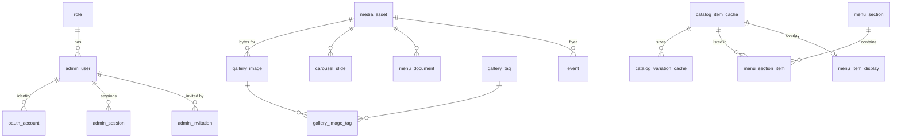

# TEAZO — Developer Build Guide

Everything you need to build against the TEAZO database and object storage.

Companion document: [`DATA-MODEL.md`](./DATA-MODEL.md) explains *why* the schema
looks like this. This document explains *how to use it*.

**Source of truth for the schema is [`teazo-site/migrations/0001_init.sql`](../teazo-site/migrations/0001_init.sql).**
If this guide and that file disagree, the file wins — tell whoever wrote this.

| | |
|---|---|
| Hosting | **Vercel** — the app has no Cloudflare bindings |
| Database | Cloudflare D1 (SQLite) — 26 tables, 31 indexes, 6 triggers — reached through a proxy Worker |
| Object storage | Cloudflare R2 — bucket `teazo-media`, served from a custom domain |
| Catalog | Square API (authoritative — we cache it, we do not own it) |
| Status | Migrations and proxy Worker written and tested locally. **Nothing deployed yet.** |

---

## Contents

1. [Before you write any code](#1-before-you-write-any-code)
2. [Reaching D1 and R2 from Vercel](#2-reaching-d1-and-r2-from-vercel)
3. [The read path — getting data to the frontend](#3-the-read-path--getting-data-to-the-frontend)
4. [Object storage — how a file becomes a URL](#4-object-storage--how-a-file-becomes-a-url)
5. [Syncing Square into D1](#5-syncing-square-into-d1)
6. [Admin writes — the mutation contract](#6-admin-writes--the-mutation-contract)
7. [Auth and middleware](#7-auth-and-middleware)
8. [Deployment, cron and environments](#8-deployment-cron-and-environments)
9. [Table reference](#9-table-reference)
10. [Gotchas](#10-gotchas)
11. [Who builds what](#11-who-builds-what)

---

## 1. Before you write any code

### The architecture is decided

**Hosting is Vercel.** The database is still Cloudflare D1 and object storage is
still Cloudflare R2. Because D1 is only reachable from inside a Worker, a small
proxy Worker sits between them — see [§2](#2-reaching-d1-and-r2-from-vercel).
This is Cloudflare's own documented approach for exactly this situation.

**Nothing is deployed.** `wrangler.jsonc` has empty `database_id` fields and
the buckets do not exist. R2 is not even enabled on the account yet — it needs a
billing profile added in the dashboard first. Until someone runs the create
commands, `--local` is the only thing that works. That is fine: **you can build
almost everything against a local D1 file.**

### The one rule

> **Square owns the catalog. D1 owns a copy plus the curation Square cannot express.**

Never make a D1 column the editable source of truth for something Square owns —
item names, prices, variations, category membership and ordering, modifier rules,
sold-out state, online visibility, store hours. If an admin can edit it in our UI
*and* in the Square dashboard, the website and the register will disagree in front
of a customer.

What D1 legitimately owns is in [§5.1](#51-what-we-cache-vs-what-we-own).

---

## 2. Reaching D1 and R2 from Vercel

The app is hosted on **Vercel**. The database is still **Cloudflare D1** and the
object storage is still **Cloudflare R2**. Those are compatible, but not for
free: D1 is only reachable from inside a Worker, so we run one.

> From Cloudflare's own docs: *"To access a D1 database outside of a Worker
> project, you need to create an API using a Worker."* The D1 REST API is not
> an alternative for the request path — Cloudflare describes it as *"best
> suited for administrative use as the global Cloudflare API rate limit
> applies."*

### 2.1 The shape of it

```
                    ┌──────────────────────────────┐
   browser ────────▶│  Vercel — Next.js app        │
        │           │  teazo-site/                 │
        │           └───────┬──────────────┬───────┘
        │                   │              │
        │       HTTPS +     │              │  S3 API +
        │       bearer      │              │  R2 access keys
        │                   ▼              ▼
        │           ┌───────────────┐  ┌──────────────────┐
        │           │ Worker        │  │ R2 bucket        │
        │           │ teazo-d1-proxy│  │ teazo-media      │
        │           └───────┬───────┘  └──────────────────┘
        │                   │ binding             ▲
        │                   ▼                     │ CDN, cached
        │           ┌───────────────┐             │
        │           │ D1: teazo-db  │             │
        │           └───────────────┘             │
        └─────────────────────────────────────────┘
              image reads go straight to media.<domain>,
              never through Vercel
```

Three things follow from this diagram, and they drive the rest of the guide:

1. **Writes to the database cross a network hop.** Batch aggressively; a page
   that makes eight sequential queries pays eight round trips.
2. **Reads of media do not touch Vercel at all.** They go to the R2 custom
   domain and are served from Cloudflare's CDN. That is faster and cheaper than
   proxying bytes through a function.
3. **The proxy Worker is a real deployable** with an owner, a secret, and a
   deploy step. It is small — one file — but it is not free.

### 2.2 Repository layout

```
Teazo-Site/
├── teazo-site/            Next.js app  →  deployed to Vercel
│   ├── app/
│   └── migrations/        the D1 schema lives with the app
└── teazo-d1-proxy/        Cloudflare Worker  →  deployed with wrangler
    ├── src/index.ts       /query, /batch, and the scheduled sweeper
    ├── wrangler.jsonc     the only file in the repo with bindings
    └── tsconfig.json
```

> **The Worker must live outside `teazo-site/`.** `teazo-site/tsconfig.json`
> has `"include": ["**/*.ts", …]` with only `node_modules` excluded, so a
> Worker placed inside the app directory gets type-checked by `next build` and
> fails it on `D1Database` and `R2Bucket`. Keeping it a sibling avoids the
> problem entirely rather than papering over it with an `exclude` entry.

`wrangler.jsonc` points `migrations_dir` back at `../teazo-site/migrations`.
Wrangler accepts a path outside its own project, and the schema belongs next to
the app that depends on it.

### 2.3 The proxy Worker

The whole thing is [`teazo-d1-proxy/src/index.ts`](../teazo-d1-proxy/src/index.ts).
It exposes two endpoints and one cron:

| | |
|---|---|
| `POST /query` | `{ sql, params }` → one statement, returns D1's `.all()` result |
| `POST /batch` | `{ statements: [{sql, params}] }` → `env.DB.batch()`, all-or-nothing |
| `scheduled()` | the sweeper — see [§8.3](#83-the-sweeper) |

Auth is a bearer token compared in constant time (both sides are SHA-256'd
first, so the comparison never branches on length).

**On accepting arbitrary SQL.** The proxy will run whatever the token-holder
sends. That is deliberate: the only intended caller is our own Next.js server,
which is exactly as trusted as the database itself. The security property that
matters is therefore *the token never reaches the browser* — it is a
server-only Vercel environment variable and must never be named
`NEXT_PUBLIC_*`. If it leaks, rotate it on both sides in one sitting:

```bash
cd teazo-d1-proxy && npx wrangler secret put PROXY_TOKEN
```

**`/batch` is the only transaction that exists.** D1 has no interactive
transactions, so anything that must be atomic has to travel as a single
`/batch` request. Splitting a logical transaction across two calls silently
gives up atomicity.

### 2.4 The client

`app/lib/d1.ts` keeps the same `prepare().bind().all()` ergonomics the rest of
this guide uses, so every SQL example works unchanged.

```ts
// teazo-site/app/lib/d1.ts
const URL_ = process.env.D1_PROXY_URL!;
const TOKEN = process.env.PROXY_TOKEN!;

type Stmt = { sql: string; params: unknown[] };
type D1Result<T> = { results: T[]; success: boolean; meta: { changes: number } };

async function post<T>(path: string, body: unknown): Promise<T> {
  const res = await fetch(`${URL_}${path}`, {
    method: "POST",
    headers: { authorization: `Bearer ${TOKEN}`, "content-type": "application/json" },
    body: JSON.stringify(body),
    cache: "no-store",
  });
  const json = await res.json();
  if (!res.ok) {
    // D1 constraint messages come through intact, which is what lets the
    // gallery delete handler recognise "media_asset is still referenced".
    throw new D1Error(json.message ?? json.error ?? res.statusText);
  }
  return json as T;
}

export class D1Error extends Error {}

/** Mirrors D1PreparedStatement closely enough that the SQL in this guide ports as-is. */
export function prepare(sql: string) {
  let params: unknown[] = [];
  const api = {
    bind(...p: unknown[]) { params = p; return api; },
    async all<T>() { return post<D1Result<T>>("/query", { sql, params }); },
    async first<T>() {
      const r = await post<D1Result<T>>("/query", { sql, params });
      return r.results[0] ?? null;
    },
    async run() { return post<D1Result<unknown>>("/query", { sql, params }); },
    toStmt(): Stmt { return { sql, params }; },
  };
  return api;
}

/** All-or-nothing. Send everything that must commit together in ONE call. */
export async function batch(stmts: Array<{ toStmt(): Stmt }>) {
  return post<{ results: unknown[] }>("/batch", {
    statements: stmts.map((s) => s.toStmt()),
  });
}
```

Usage is what you would expect:

```ts
import { prepare, batch } from "@/app/lib/d1";

const hours = await prepare(
  "SELECT day_of_week, display_text FROM business_hours ORDER BY day_of_week"
).all<BusinessHour>();

await batch([
  prepare("UPDATE admin_user SET deleted_at = strftime('%Y-%m-%dT%H:%M:%fZ','now') WHERE id = ?1").bind(id),
  prepare("UPDATE admin_session SET revoked_at = strftime('%Y-%m-%dT%H:%M:%fZ','now') WHERE admin_user_id = ?1 AND revoked_at IS NULL").bind(id),
]);
```

### 2.5 Environment variables

All server-only. **Nothing here may be prefixed `NEXT_PUBLIC_`** except
`R2_PUBLIC_BASE`, which is a public hostname by definition.

| Variable | Where | What |
|---|---|---|
| `D1_PROXY_URL` | Vercel | `https://teazo-d1-proxy.<sub>.workers.dev` |
| `PROXY_TOKEN` | Vercel **and** `wrangler secret put` | same value both sides |
| `R2_ACCOUNT_ID` | Vercel | Cloudflare account id |
| `R2_ACCESS_KEY_ID` | Vercel | R2 API token, scoped to one bucket |
| `R2_SECRET_ACCESS_KEY` | Vercel | ditto |
| `R2_BUCKET_NAME` | Vercel | `teazo-media` — also written to `media_asset.r2_bucket` |
| `R2_PUBLIC_BASE` | Vercel | `https://media.teazosf.com` — the R2 custom domain |
| `SQUARE_ACCESS_TOKEN` | Vercel | sandbox today |
| `SQUARE_ENV` | Vercel | `sandbox` \| `production` — see [§5.7](#57-sandbox--production-cutover) |
| `SQUARE_WEBHOOK_SIGNATURE_KEY` | Vercel | webhook verification |

Local dev uses `teazo-site/.env.local` for the app and
`teazo-d1-proxy/.dev.vars` for the Worker. Both are gitignored.

### 2.6 First 20 minutes

```bash
git clone https://github.com/W-Sammy/Teazo-Site.git
cd Teazo-Site
```

```bash
cd teazo-d1-proxy && npm install
```

```bash
npx wrangler d1 migrations apply teazo-db --local
```

```bash
npx wrangler d1 execute teazo-db --local --command "SELECT day_of_week, display_text FROM business_hours ORDER BY day_of_week;"
```

Seven rows, Monday through Sunday, ending `11:00 AM - 8:00 PM`. Now start the
proxy against that local database:

```bash
echo "PROXY_TOKEN=local-dev-token" > .dev.vars && npx wrangler dev --port 8787
```

In a second terminal, prove it answers:

```bash
curl -s http://127.0.0.1:8787/query -H "authorization: Bearer local-dev-token" -H 'content-type: application/json' -d '{"sql":"SELECT label FROM role ORDER BY id","params":[]}'
```

You should get `Owner`, `Can Edit`, `Can View`. Then point the app at it:

```bash
cd ../teazo-site && printf 'D1_PROXY_URL=http://127.0.0.1:8787\nPROXY_TOKEN=local-dev-token\n' > .env.local && npm install && npm run dev
```

### 2.7 Useful scripts

In `teazo-d1-proxy/package.json` (already there):

```bash
npm run dev                  # proxy against local D1
npm run dev:cron             # same, plus a triggerable scheduled handler
npm run db:migrate:local     # apply migrations to the local D1
npm run db:migrate:prod      # apply to the remote production D1
npm run db:backup            # wrangler d1 export -> backup.sql
npm run deploy               # ship the Worker
npm run tail                 # live logs from the deployed Worker
```

There is deliberately no unsuffixed `db:migrate`. `--local` and `--remote`
should never be one typo apart.

### 2.8 The cost of the hop

Every database read is now Vercel → Worker → D1 instead of a local binding
call. Budget roughly 30–80 ms per round trip depending on regions, and design
around it:

- **Batch reads.** One `/batch` beats six `/query` calls.
- **Cache.** Public pages should set `export const revalidate = 300` — the menu
  and contact details change rarely, and this removes the hop from the hot path
  entirely.
- **Do not fan out per row.** The menu page reads sections and variations in two
  queries, never one query per item.

---

## 3. The read path — getting data to the frontend

Every public page currently renders from a TypeScript literal. This section
replaces each one.

### 3.1 A typed query helper

```ts
// app/lib/queries.ts
import { getDb } from "./db";

export type BusinessProfile = {
  business_name: string;
  street_address: string;
  locality: string;
  phone: string | null;
  email: string | null;
  map_query: string;
};

export type BusinessHour = {
  day_of_week: number;   // 0 = Monday
  display_text: string;
  is_closed: number;
};

export type SiteLink = {
  key: string;
  link_group: "social" | "delivery" | "other";
  label: string;
  url: string;
  aria_label: string | null;
  sort_order: number;
};

const DAY_LABELS = ["Monday","Tuesday","Wednesday","Thursday","Friday","Saturday","Sunday"];
export const dayLabel = (d: number) => DAY_LABELS[d];

export async function getBusinessProfile() {
  const db = await getDb();
  return db.prepare("SELECT * FROM business_profile WHERE id = 1").first<BusinessProfile>();
}

export async function getBusinessHours() {
  const db = await getDb();
  const { results } = await db
    .prepare("SELECT day_of_week, display_text, is_closed FROM business_hours ORDER BY day_of_week")
    .all<BusinessHour>();
  return results;
}

export async function getSiteLinks(group: "social" | "delivery") {
  const db = await getDb();
  const { results } = await db
    .prepare(`SELECT key, link_group, label, url, aria_label, sort_order
                FROM site_link
               WHERE link_group = ?1 AND is_active = 1
               ORDER BY sort_order, key`)
    .bind(group)
    .all<SiteLink>();
  return results;
}
```

### 3.2 Per-page queries

| Page | Replaces | Query |
|---|---|---|
| `/contact` | `contact-content.ts:22-41` | `getBusinessProfile()` + `getBusinessHours()` + `getSiteLinks('social')` |
| `/delivery` | `delivery/page.tsx:70-72` | `getSiteLinks('delivery')` + two `content_block` rows |
| `/` | `page.tsx:109-122`, `image-carousel.tsx:7-13` | `getSiteLinks('social')` + carousel query below |
| `/gallery` | `gallery/page.tsx:18-28` | gallery query below |
| `/menu` | `menu/page.tsx:80-700` | menu query in [§3.3](#33-the-menu-query) |
| `/static-menu` | `static-menu-content.tsx:57` | `menu_document WHERE is_current = 1` |

Carousel:

```sql
SELECT cs.id, cs.alt, cs.caption, cs.link_url, ma.id AS media_id
  FROM carousel_slide cs
  JOIN media_asset ma ON ma.id = cs.media_id AND ma.deleted_at IS NULL
 WHERE cs.is_active = 1
 ORDER BY cs.sort_order, cs.id;
```

Public gallery:

```sql
SELECT gi.id, gi.name, gi.caption, gi.alt, ma.id AS media_id
  FROM gallery_image gi
  JOIN media_asset ma ON ma.id = gi.media_id AND ma.deleted_at IS NULL
 WHERE gi.is_published = 1 AND gi.deleted_at IS NULL
 ORDER BY gi.sort_order, gi.id;
```

### 3.3 The menu query

This is the only complicated one. Four tables, and the orphan rule matters.

```sql
SELECT
  ms.id            AS section_id,
  ms.title         AS section_title,
  ms.subtitle      AS section_subtitle,
  ms.sort_order    AS section_order,
  ci.square_object_id,
  ci.name          AS item_name,
  ci.description,
  ci.square_image_url,
  msi.position,
  mid.badge,
  mid.is_featured,
  mid.image_media_id
FROM menu_section ms
JOIN menu_section_item msi
  ON msi.section_id = ms.id AND msi.square_env = ms.square_env
JOIN catalog_item_cache ci
  ON ci.square_object_id = msi.square_catalog_object_id
 AND ci.square_env       = msi.square_env
LEFT JOIN menu_item_display mid
  ON mid.square_catalog_object_id = ci.square_object_id
 AND mid.square_env              = ci.square_env
WHERE ms.square_env    = ?1          -- 'sandbox' | 'production'
  AND ms.is_published  = 1
  AND ci.is_deleted    = 0            -- orphan rule: never render a dead item
  AND COALESCE(mid.hide_on_website, 0) = 0
ORDER BY ms.sort_order, ms.id, msi.position, ci.square_object_id;
```

Prices come from the variation table — an item can have several (Regular, Large):

```sql
SELECT square_object_id, square_variation_id, name, price_cents, currency, is_sold_out
  FROM catalog_variation_cache
 WHERE square_env = ?1 AND square_object_id IN (/* chunked */)
 ORDER BY square_object_id, ordinal;
```

Run those as two queries and stitch in JS. Do not try to do it in one — you get
a row per item×variation and have to de-duplicate anyway.

> **`ORDER BY` always ends with a tiebreak column.** `sort_order` is not unique,
> and without `, id` SQLite may return equal rows in a different order between
> requests, so the page visibly reshuffles.

### 3.4 Caching

A D1 read in a server component makes the route **dynamic**, which kills the
static generation these pages have today. Pick deliberately per route:

```ts
export const revalidate = 300; // /menu, /gallery, /contact — content changes rarely
```

Use `revalidate` for public pages and full dynamic only for `/admin`.

---

## 4. Object storage — how a file becomes a URL

This is the part people get wrong, so read it before writing upload code.

R2 is reached two different ways depending on direction:

| Direction | Path | Credential |
|---|---|---|
| Write (upload, delete) | Vercel → `https://<account_id>.r2.cloudflarestorage.com`, S3 API | R2 access key id + secret |
| Read (every ``) | browser → `https://media.teazosf.com`, CDN-cached | none — public |

Reads never touch Vercel. That is the point.

### 4.1 The rule: the database stores a key, never a URL

`media_asset` has `r2_bucket` and `r2_key` and deliberately **no `url` column**.

A URL is a *derived* value. It depends on which bucket, which custom domain, and
which serving strategy — all of which change independently of the file. Store an
absolute URL and every row rots the day the domain changes. Store the key and
the URL is a pure function you can change in one place.

```
media_asset row                          rendered
┌─────────────────────────────────┐
│ id        6f2c…9a1              │──▶  https://media.teazosf.com/gallery/2026/09/x.webp
│ r2_bucket teazo-media           │
│ r2_key    gallery/2026/09/x.webp│
│ mime_type image/webp            │
│ byte_size 184320                │
└─────────────────────────────────┘
```

```ts
// app/lib/media.ts
const BASE = process.env.R2_PUBLIC_BASE!; // https://media.teazosf.com

export function toPublicUrl(asset: { r2_key: string }) {
  return `${BASE}/${asset.r2_key}`;
}
```

One function. Swap the domain, or move to signed URLs, and nothing else changes.

### 4.2 Key layout

```
gallery/{yyyy}/{mm}/{uuid}.{ext}
menu/items/{square_object_id}/{uuid}.{ext}
carousel/{uuid}.{ext}
events/{event_id}/{uuid}.{ext}
documents/menu/{uuid}.pdf
branding/{uuid}.{ext}
```

UUID keys, not content hashes. Dedupe-by-checksum is a feature nobody asked for
and it makes "delete then re-upload the same file" fail on a unique index.
Because keys are never reused, everything served from them is safely
immutable-cacheable.

```ts
const EXT: Record<string, string> = {
  "image/jpeg": "jpg", "image/png": "png",
  "image/webp": "webp", "application/pdf": "pdf",
};

export function mintGalleryKey(mime: string, now = new Date()) {
  const yyyy = now.getUTCFullYear();
  const mm = String(now.getUTCMonth() + 1).padStart(2, "0");
  return `gallery/${yyyy}/${mm}/${crypto.randomUUID()}.${EXT[mime]}`;
}
```

### 4.3 The S3 client

Use [`aws4fetch`](https://github.com/mhart/aws4fetch) — about 5 KB, no AWS SDK.
`@aws-sdk/client-s3` also works and is heavier; pick it only if you need
multipart uploads.

```bash
npm install aws4fetch
```

```ts
// app/lib/r2.ts
import { AwsClient } from "aws4fetch";

export const r2 = new AwsClient({
  accessKeyId: process.env.R2_ACCESS_KEY_ID!,
  secretAccessKey: process.env.R2_SECRET_ACCESS_KEY!,
  service: "s3",
  region: "auto",              // R2 is always "auto"
});

export const r2Url = (key: string) =>
  `https://${process.env.R2_ACCOUNT_ID}.r2.cloudflarestorage.com/${process.env.R2_BUCKET_NAME}/${key}`;

export async function putObject(key: string, body: ArrayBuffer, contentType: string) {
  const res = await r2.fetch(r2Url(key), {
    method: "PUT",
    body,
    headers: { "content-type": contentType },
  });
  if (!res.ok) throw new Error(`R2 PUT failed: ${res.status} ${await res.text()}`);
}

export async function deleteObject(key: string) {
  const res = await r2.fetch(r2Url(key), { method: "DELETE" });
  // R2 DELETE is idempotent — 404 is success for our purposes.
  if (!res.ok && res.status !== 404) throw new Error(`R2 DELETE failed: ${res.status}`);
}
```

### 4.4 The upload route

> **Vercel caps a serverless function request body at 4.5 MB.** Our limit is
> 10 MB, so bytes cannot always go through the function. Two options:
>
> - **Proxy through the route** (below) — simple, and fine while uploads stay
>   under ~4 MB. Phone photos routinely exceed that.
> - **Presigned PUT** ([§4.5](#45-presigned-uploads-for-files-over-45-mb)) — the
>   browser uploads straight to R2 and only tells the server the key afterwards.
>
> Build the proxy version first because it is easier to get right, and switch
> when a real upload fails. Both write identical rows.

```ts
// app/api/admin/gallery/route.ts
import { prepare, batch } from "@/app/lib/d1";
import { putObject } from "@/app/lib/r2";
import { requireAdmin } from "@/app/lib/auth";
import { mintGalleryKey, sniffMime, normalizeTag, sortKey } from "@/app/lib/media";

const MAX_BYTES = 10 * 1024 * 1024;
const ALLOWED = ["image/jpeg", "image/png", "image/webp"] as const;

export async function POST(request: Request) {
  const admin = await requireAdmin(request, 2); // role 2 = Can Edit
  if (!admin) return Response.json({ error: "Unauthorized" }, { status: 401 });

  const form = await request.formData();
  const file = form.get("file");
  const name = String(form.get("name") ?? "").trim();
  const tags = JSON.parse(String(form.get("tags") ?? "[]")) as string[];

  if (!(file instanceof File)) return Response.json({ error: "file required" }, { status: 400 });
  if (!name) return Response.json({ error: "name required" }, { status: 400 });

  const bytes = await file.arrayBuffer();
  if (bytes.byteLength === 0)       return Response.json({ error: "empty file" }, { status: 400 });
  if (bytes.byteLength > MAX_BYTES) return Response.json({ error: "file too large" }, { status: 413 });

  // Sniff magic bytes — never trust File.type, it is client-supplied.
  const mime = sniffMime(new Uint8Array(bytes.slice(0, 16)));
  if (!mime || !ALLOWED.includes(mime as typeof ALLOWED[number])) {
    return Response.json({ error: "unsupported image type" }, { status: 415 });
  }

  const key = mintGalleryKey(mime);
  const mediaId = crypto.randomUUID();
  const imageId = crypto.randomUUID();

  // 1. Bytes first. If D1 fails after this we leak one object, which the
  //    sweeper cannot see but which costs nothing. If we wrote D1 first and R2
  //    failed, we would have a row pointing at nothing and a broken page.
  //    Leak over dangle, always.
  await putObject(key, bytes, mime);

  // 2. Metadata, all-or-nothing, in ONE /batch — that is the only transaction.
  const stmts = [
    prepare(
      `INSERT INTO media_asset
         (id, r2_bucket, r2_key, mime_type, byte_size, original_filename, purpose, uploaded_by)
       VALUES (?1, ?2, ?3, ?4, ?5, ?6, 'gallery', ?7)`
    ).bind(mediaId, process.env.R2_BUCKET_NAME!, key, mime, bytes.byteLength, file.name, admin.admin_id),

    prepare(
      `INSERT INTO gallery_image (id, media_id, name, name_sort_key) VALUES (?1, ?2, ?3, ?4)`
    ).bind(imageId, mediaId, name, sortKey(name)),
  ];

  for (const raw of tags) {
    const norm = normalizeTag(raw);
    if (!norm) continue;
    stmts.push(
      prepare(
        `INSERT INTO gallery_tag (id, name, name_normalized) VALUES (?1, ?2, ?3)
         ON CONFLICT(name_normalized) DO NOTHING`
      ).bind(crypto.randomUUID(), raw.trim(), norm),
      prepare(
        `INSERT INTO gallery_image_tag (image_id, tag_id)
         SELECT ?1, id FROM gallery_tag WHERE name_normalized = ?2`
      ).bind(imageId, norm)
    );
  }

  await batch(stmts);

  return Response.json({ id: imageId, url: `${process.env.R2_PUBLIC_BASE}/${key}` }, { status: 201 });
}
```

Helpers:

```ts
// app/lib/media.ts
export const normalizeTag = (s: string) => s.trim().replace(/\s+/g, " ").toLowerCase();

// gallery_image.name_sort_key — SQLite's collations cannot reproduce
// localeCompare, and our content is bilingual. Compute the key at write time.
export const sortKey = (s: string) =>
  s.normalize("NFKD").replace(/\p{Diacritic}/gu, "").toLowerCase().trim();

export function sniffMime(head: Uint8Array): string | null {
  if (head[0] === 0xff && head[1] === 0xd8) return "image/jpeg";
  if (head[0] === 0x89 && head[1] === 0x50) return "image/png";
  if (head[0] === 0x25 && head[1] === 0x50) return "application/pdf";
  if (String.fromCharCode(...head.slice(0, 4)) === "RIFF" &&
      String.fromCharCode(...head.slice(8, 12)) === "WEBP") return "image/webp";
  return null;
}
```

### 4.5 Presigned uploads, for files over 4.5 MB

Two round trips, and the bytes never enter a Vercel function.

```ts
// app/api/admin/gallery/presign/route.ts
export async function POST(request: Request) {
  const admin = await requireAdmin(request, 2);
  if (!admin) return Response.json({ error: "Unauthorized" }, { status: 401 });

  const { mime } = await request.json();
  if (!ALLOWED.includes(mime)) return Response.json({ error: "unsupported" }, { status: 415 });

  const key = mintGalleryKey(mime);
  const signed = await r2.sign(
    new Request(r2Url(key), { method: "PUT", headers: { "content-type": mime } }),
    { aws: { signQuery: true }, headers: { "x-amz-expires": "600" } } // 10 minutes
  );

  return Response.json({ uploadUrl: signed.url, key });
}
```

The browser `PUT`s the file to `uploadUrl`, then posts `{ key, name, tags }` to
a second route that does only the `batch()` from §4.4. That second route
**must re-validate**: `HEAD` the object to confirm it exists and read its real
size and content type from R2 rather than trusting the client.

### 4.6 Serving media from the R2 custom domain

Attach a custom domain to the bucket: Cloudflare dashboard → R2 → `teazo-media`
→ Settings → Public access → Custom Domains → `media.teazosf.com`.

> **Do not use the `r2.dev` subdomain.** Cloudflare states it is
> "rate-limited and should only be used for development purposes", and it
> cannot use WAF rules, caching, or access controls. It must never appear in
> `R2_PUBLIC_BASE`.

**Add a Cache Rule**, or the custom domain buys you very little: Cloudflare
caches only a subset of file extensions by default. Dashboard → the zone →
Rules → Caching → Cache Rules → hostname equals `media.teazosf.com` →
**Cache Everything**.

Verify it works by requesting the same object twice:

```bash
curl -sI https://media.teazosf.com/gallery/2026/09/x.webp | grep -i cf-cache-status
```

The second response should say `HIT`. `DYNAMIC` or `BYPASS` means the rule is
missing.

This replaces the `/api/media/[id]` route an earlier draft of this guide
proposed. It is strictly better: no function invocation, no D1 lookup, and
CDN caching on every read.

### 4.7 `next/image`

Vercel runs the full Next.js image optimizer (`sharp` is available), so
`<Image>` works normally — resizing, WebP conversion, and `srcset` all included.

`next.config.ts` builds `remotePatterns` from `app/lib/imageHosts.ts`, which
today allowlists only the Square **sandbox** bucket. It needs the R2 domain,
and it will need the Square production host at cutover:

```ts
// teazo-site/app/lib/imageHosts.ts
export const allowedHosts = [
  "media.teazosf.com",                              // R2 custom domain — our own media
  "items-images-sandbox.s3.us-west-2.amazonaws.com", // Square sandbox
  // "items-images-production.s3.us-west-2.amazonaws.com", // add at cutover — §5.7
];
```

Miss this and every `<Image>` of our own media fails with an "hostname is not
configured" error at runtime, not at build time.

> `public/carousel_images/dried_leaves.jpg` is **8.1 MB**. The optimizer will
> serve a resized derivative, but it still has to fetch and process the
> original on the first request. Resize the carousel images during the
> migration below rather than shipping 8 MB originals to R2.

### 4.8 Deletion — three steps, in this order

Media is **soft**-deleted, and a database trigger refuses to soft-delete a file
that is still referenced by a gallery image, carousel slide, menu document,
content block, site link, event flyer, menu item photo, or admin avatar.

Check usage first so you can return a helpful error rather than surfacing a raw
constraint failure:

```ts
const inUse = await prepare(
  `SELECT 'gallery' AS t FROM gallery_image      WHERE media_id = ?1 AND deleted_at IS NULL
   UNION ALL SELECT 'carousel' FROM carousel_slide WHERE media_id = ?1
   UNION ALL SELECT 'menu_pdf' FROM menu_document  WHERE media_id = ?1
   UNION ALL SELECT 'content'  FROM content_block  WHERE media_id = ?1
   UNION ALL SELECT 'link'     FROM site_link      WHERE icon_media_id = ?1
   UNION ALL SELECT 'event'    FROM event          WHERE flyer_media_id = ?1 AND deleted_at IS NULL
   UNION ALL SELECT 'menu_item' FROM menu_item_display WHERE image_media_id = ?1
   LIMIT 1`
).bind(mediaId).first<{ t: string }>();

if (inUse) {
  return Response.json({ error: "still_in_use", usedBy: inUse.t }, { status: 409 });
}

await batch([
  // The gallery row is retired BEFORE the media row, or the trigger fires.
  prepare("UPDATE gallery_image SET deleted_at = strftime('%Y-%m-%dT%H:%M:%fZ','now') WHERE id = ?1").bind(imageId),
  prepare("UPDATE media_asset  SET deleted_at = strftime('%Y-%m-%dT%H:%M:%fZ','now') WHERE id = ?1").bind(mediaId),
  prepare("INSERT INTO pending_r2_deletion (r2_bucket, r2_key) VALUES (?1, ?2)").bind(bucket, key),
]);
```

Bytes are **not** deleted here. The sweeper ([§8.3](#83-the-sweeper)) drains
`pending_r2_deletion` after a 24-hour grace period, and that gap is the only
undo window the media pipeline has — see [§8.6](#86-rollback).

Because the app catches `D1Error` and reads its message, a trigger firing
anyway (a race, a missed usage check) still produces a sensible 409 rather than
a 500.

### 4.9 Migrating existing assets

`public/` is 18 MB / 101 files. Split by **who owns the file**, not by type:

| Stays in repo | Moves to R2 |
|---|---|
| `admin_icons/` (14), `social_icons/` (4) | `menu_items/` — 65 `.webp`, 6.4 MB |
| `pdfjs/` (2, vendored) | `carousel_images/` — 5 files, 8.1 MB |
| logos, `pink_scribble.png` | `promotions/` (1), `teazo-menu.pdf` |

~14.7 MB migrates. A script, not an afternoon of clicking:

```ts
// scripts/migrate-assets.ts — run with: npx tsx scripts/migrate-assets.ts
import { readFile } from "node:fs/promises";
import { glob } from "node:fs/promises";
import { putObject } from "../app/lib/r2";
import { prepare, batch } from "../app/lib/d1";

const MIME: Record<string, string> = {
  ".webp": "image/webp", ".jpg": "image/jpeg", ".jpeg": "image/jpeg",
  ".png": "image/png", ".pdf": "application/pdf",
};

for await (const path of glob("public/menu_items/**/*.webp")) {
  const bytes = await readFile(path);
  const ext = path.slice(path.lastIndexOf("."));
  const key = `menu/items/legacy/${crypto.randomUUID()}${ext}`;

  await putObject(key, bytes.buffer as ArrayBuffer, MIME[ext]);
  await batch([
    prepare(
      `INSERT INTO media_asset (id, r2_bucket, r2_key, mime_type, byte_size, original_filename, purpose)
       VALUES (?1, ?2, ?3, ?4, ?5, ?6, 'menu_item')`
    ).bind(crypto.randomUUID(), process.env.R2_BUCKET_NAME!, key, MIME[ext], bytes.byteLength, path),
  ]);
  console.log(key, "←", path);
}
```

Resize the five carousel JPEGs before uploading them. Once the rows exist,
delete the originals from `public/` in the same PR that switches the components
over — not before, or the site breaks between merges.

---

## 5. Syncing Square into D1

### 5.1 What we cache vs what we own

| Square owns (cache only, never edit) | D1 owns (edit freely) |
|---|---|
| item name, description | section titles & subtitles |
| variations, prices, currency | the synthetic "TEAZO Special" section |
| category membership + `ordinal` | display `position` within a section |
| modifier lists, selection rules | local photo override, badges, featured |
| sold-out state, online visibility | allergen notes, hide-on-website |
| item images | everything non-catalog |

### 5.2 Prerequisite: fix the variations bug first

`PUT /api/square/products/[id]` (lines 90-104) rewrites `itemData.variations` to
a **single element named "Regular"**. `POST` does the same. Every admin edit
silently deletes all but the first size.

For a boba shop, sizes *are* the variations. **Do not build the sync until this
is fixed**, or the cache faithfully mirrors data corruption. The corrected
handler must read all variations, preserve each one's `id` and `version`, and
send them all back:

```ts
const currentVariations = (currentItem.itemData?.variations ?? []) as CatalogObject.ItemVariation[];

variations: currentVariations.map((v) => ({
  type: "ITEM_VARIATION" as const,
  id: v.id,
  version: v.version,
  itemVariationData: {
    ...v.itemVariationData,
    // apply only the edits the request actually asked for
  },
})),
```

Also **remove the `BigInt.prototype.toJSON` monkey-patch** in
`app/lib/square.ts:12-21`. It is a global side effect of an import, it is lossy,
and every price passes through it. Convert explicitly instead:

```ts
const toInt = (v?: bigint | number | null) => (v == null ? null : Number(v));
```

### 5.3 Full sync

```ts
// app/lib/square-sync.ts
import { prepare, batch } from "@/app/lib/d1";

export async function fullSync() {
  const sqEnv = process.env.SQUARE_ENV!; // 'sandbox' | 'production'
  const items = squareClient.catalog.list({ types: "ITEM" });

  const itemStmts = [];
  const varStmts = [];

  for await (const obj of items) {
    const item = obj as CatalogObject.Item;
    if (!item.id) continue;

    itemStmts.push(prepare(
      `INSERT INTO catalog_item_cache
         (square_object_id, square_env, square_version, name, description,
          square_image_url, categories_json, is_deleted, synced_at)
       VALUES (?1,?2,?3,?4,?5,?6,?7,0, strftime('%Y-%m-%dT%H:%M:%fZ','now'))
       ON CONFLICT(square_object_id, square_env) DO UPDATE SET
         square_version   = excluded.square_version,
         name             = excluded.name,
         description      = excluded.description,
         square_image_url = excluded.square_image_url,
         categories_json  = excluded.categories_json,
         is_deleted       = 0,
         synced_at        = excluded.synced_at`
    ).bind(
      item.id, sqEnv, toInt(item.version),
      item.itemData?.name ?? null,
      item.itemData?.description ?? null,
      null,
      JSON.stringify((item.itemData?.categories ?? []).map((c) => ({ id: c.id, ordinal: toInt(c.ordinal) })))
    ));

    // EVERY variation, not just [0].
    for (const v of (item.itemData?.variations ?? []) as CatalogObject.ItemVariation[]) {
      if (!v.id) continue;
      const money = v.itemVariationData?.priceMoney;
      varStmts.push(prepare(
        `INSERT INTO catalog_variation_cache
           (square_variation_id, square_env, square_object_id, square_version,
            name, price_cents, currency, ordinal, synced_at)
         VALUES (?1,?2,?3,?4,?5,?6,?7,?8, strftime('%Y-%m-%dT%H:%M:%fZ','now'))
         ON CONFLICT(square_variation_id, square_env) DO UPDATE SET
           name = excluded.name, price_cents = excluded.price_cents,
           currency = excluded.currency, ordinal = excluded.ordinal,
           synced_at = excluded.synced_at`
      ).bind(
        v.id, sqEnv, item.id, toInt(v.version),
        v.itemVariationData?.name ?? null,
        toInt(money?.amount), money?.currency ?? "USD",
        toInt(v.itemVariationData?.ordinal) ?? 0
      ));
    }
  }

  // Items before variations — the FK depends on the parent existing.
  // Each chunk is one /batch request, so each chunk is one transaction.
  for (const c of chunk(itemStmts, 20)) await batch(c);
  for (const c of chunk(varStmts, 20)) await batch(c);
}
```

### 5.4 Chunking for D1's limits

D1 allows ~100 bound parameters per statement. `catalog_item_cache` binds 7 per
row, so a batch of 20 statements is comfortably inside the limit with room for
the variation table's 8. Do not raise this above ~30 without measuring.

```ts
const chunk = <T,>(a: T[], n: number) =>
  Array.from({ length: Math.ceil(a.length / n) }, (_, i) => a.slice(i * n, i * n + n));
```

### 5.5 Delta sync and webhooks

Square emits exactly **one** catalog webhook, `catalog.version.updated`, and its
payload carries only the merchant's new catalog version — **it does not say which
objects changed.** So there is no object-level delta to key on. The design is:

1. Webhook arrives → verify the signature → read the new version.
2. Compare to `square_sync_state.last_catalog_version` for this `square_env`.
3. If newer, run a delta scan with `SearchCatalogObjects`, passing `beginTime`
   = `last_synced_at` and `includeDeletedObjects: true`.
4. Upsert live objects; mark returned tombstones `is_deleted = 1`.
5. Write the new watermark.

```ts
await prepare(
  `INSERT INTO square_sync_state (key, square_env, last_catalog_version, last_synced_at)
   VALUES ('catalog', ?1, ?2, strftime('%Y-%m-%dT%H:%M:%fZ','now'))
   ON CONFLICT(key, square_env) DO UPDATE SET
     last_catalog_version = excluded.last_catalog_version,
     last_synced_at       = excluded.last_synced_at,
     last_error           = NULL`
).bind(sqEnv, newVersion).run();
```

### 5.6 Deletes and orphans

`DELETE /api/square/products/[id]` returns `deletedObjectIds` and currently
**consumes it nowhere**. It must mark the cache:

```ts
await batch(
  deletedObjectIds.map((id) =>
    prepare(
      "UPDATE catalog_item_cache SET is_deleted = 1 WHERE square_object_id = ?1 AND square_env = ?2"
    ).bind(id, sqEnv)
  )
);
```

Never hard-delete a cache row: `menu_section_item` and `menu_item_display`
reference it with `ON DELETE RESTRICT`, so `is_deleted` is the tombstone. The
menu query already filters `ci.is_deleted = 0`, so the item disappears from the
public page while the admin's curation survives if Square restores it.

> **A re-created Square item gets a new id**, so its curation is lost. That is
> inherent to keying on Square ids, and worth telling the client.

### 5.7 Sandbox → production cutover

`app/lib/square.ts:8` hardcodes `SquareEnvironment.Sandbox`. Read it from
`env.SQUARE_ENV` instead. Then:

1. Set the production Square token as a secret.
2. `INSERT INTO square_sync_state (key, square_env) VALUES ('catalog','production')`
   — `last_synced_at` NULL correctly forces a full initial sync.
3. Run `fullSync` against production. Sandbox rows are untouched: every key
   includes `square_env`.
4. Re-create menu sections and curation against production ids. **This is manual
   work** — sandbox and production share no object ids.
5. Add the production image host to `app/lib/imageHosts.ts`.
6. Flip `SQUARE_ENV`.

Cheapest if curation work starts *after* cutover.

---

## 6. Admin writes — the mutation contract

Every route below requires a valid session ([§7](#7-auth-and-middleware)).
Roles are `1 = Owner`, `2 = Can Edit`, `3 = Can View` — matching
`ADMIN_ROLE_LABELS` on the `steven-create-admins` branch.

### 6.1 Gallery

| Method | Path | Role | Effect |
|---|---|---|---|
| `GET` | `/api/admin/gallery` | 3 | list with search/tag filter/sort |
| `POST` | `/api/admin/gallery` | 2 | upload — see [§4.4](#44-the-upload-route) |
| `PATCH` | `/api/admin/gallery/[id]` | 2 | rename, caption, alt, tags, publish |
| `DELETE` | `/api/admin/gallery/[id]` | 2 | soft-delete — see [§4.5](#48-deletion--three-steps-in-this-order) |

The list query mirrors what `admin-gallery-client.tsx` does today —
case-insensitive substring over **name and tags**, OR-semantics tag filter:

```sql
SELECT gi.*, ma.r2_key
  FROM gallery_image gi
  JOIN media_asset ma ON ma.id = gi.media_id
 WHERE gi.deleted_at IS NULL
   AND (?1 = '' OR lower(gi.name) LIKE '%' || lower(?1) || '%'
        OR EXISTS (SELECT 1 FROM gallery_image_tag git
                     JOIN gallery_tag gt ON gt.id = git.tag_id
                    WHERE git.image_id = gi.id
                      AND gt.name_normalized LIKE '%' || lower(?1) || '%'))
 ORDER BY gi.name_sort_key;   -- or created_at DESC, per the sort dropdown
```

`LIKE '%x%'` cannot use an index. At this table's size a scan is fine; if the
gallery grows past a few thousand rows, switch to FTS5.

**Renaming must recompute `name_sort_key`.** It is `NOT NULL` and the UI sorts
on it; forget this and the sort order silently stops matching the names.

### 6.2 Tag handling

Tags are a shared vocabulary with `name_normalized UNIQUE`. Always upsert:

```sql
INSERT INTO gallery_tag (id, name, name_normalized) VALUES (?1, ?2, ?3)
ON CONFLICT(name_normalized) DO NOTHING;

INSERT INTO gallery_image_tag (image_id, tag_id)
SELECT ?1, id FROM gallery_tag WHERE name_normalized = ?2
ON CONFLICT DO NOTHING;
```

This is what stops "Matcha" and "matcha" becoming two sidebar entries — the
current `normalizeTag` in `gallery-upload-form.tsx:31-33` trims and collapses
whitespace but does **not** lowercase.

### 6.3 Admins (Settings)

Matches the stub API on `steven-create-admins`
(`app/api/admin/settings/admins-api.ts`), which currently throws on every call.

| Method | Path | Role | Notes |
|---|---|---|---|
| `GET` | `/api/admin/settings/admins` | 1 | list |
| `POST` | `/api/admin/settings/admins` | 1 | create + invite |
| `PATCH` | `/api/admin/settings/admins/[id]/role` | 1 | change role |
| `PATCH` | `/api/admin/settings/admins/[id]/invite-permission` | 1 | toggle `can_invite_users` |
| `DELETE` | `/api/admin/settings/admins/[id]` | 1 | soft-delete + revoke sessions |

Rules the schema enforces, matching `use-admins.ts`:

- `can_invite_users = 1` is **only** valid for role 2. A CHECK constraint rejects
  anything else, so changing a role to 1 or 3 must clear the flag in the same
  statement.
- At most one Owner — a partial unique index. "At least one Owner" is **not**
  expressible in SQLite; your handler must refuse to delete or demote the last
  one (`use-admins.ts:21, :53-56`).
- `email_normalized` is unique among live rows. Normalize with
  `email.trim().toLowerCase()` — `addAdmin` currently does no duplicate check at
  all.

**Deleting an admin must revoke their sessions in the same batch.** The FK is
`ON DELETE CASCADE`, but we soft-delete, so the cascade never fires:

```ts
await batch([
  prepare("UPDATE admin_user SET deleted_at = strftime('%Y-%m-%dT%H:%M:%fZ','now') WHERE id = ?1").bind(id),
  prepare("UPDATE admin_session SET revoked_at = strftime('%Y-%m-%dT%H:%M:%fZ','now') WHERE admin_user_id = ?1 AND revoked_at IS NULL").bind(id),
]);
```

### 6.4 Website content

| Method | Path | Role | Effect |
|---|---|---|---|
| `GET` | `/api/admin/content` | 3 | all blocks grouped by `page_key` |
| `PUT` | `/api/admin/content/[key]` | 2 | update one block |

`content_block.key` **must** equal `page_key || '.' || slot_key` — a CHECK
enforces it. Build the key, do not accept it from the client.

### 6.5 Menu curation

| Method | Path | Role | Effect |
|---|---|---|---|
| `PUT` | `/api/admin/menu/sections/[id]` | 2 | title, subtitle, order, publish |
| `PUT` | `/api/admin/menu/sections/[id]/items` | 2 | membership + `position` |
| `PUT` | `/api/admin/menu/items/[squareId]/display` | 2 | photo, badge, featured, hide |

These replace the `console.log` stubs in `admin-list-view.tsx:127-132`. Note the
overlay upsert must supply `square_env`:

```sql
INSERT INTO menu_item_display
  (square_catalog_object_id, square_env, image_media_id, badge, is_featured, updated_by)
VALUES (?1, ?2, ?3, ?4, ?5, ?6)
ON CONFLICT(square_catalog_object_id, square_env) DO UPDATE SET
  image_media_id = excluded.image_media_id,
  badge          = excluded.badge,
  is_featured    = excluded.is_featured,
  updated_by     = excluded.updated_by;
```

### 6.6 Events, hours, links, contact inbox

| Method | Path | Role |
|---|---|---|
| `GET/POST` `/api/admin/events`, `PUT/DELETE` `/api/admin/events/[id]` | 2 |
| `PUT` `/api/admin/hours` (bulk, 7 rows) | 2 |
| `POST/DELETE` `/api/admin/hours/exceptions` | 2 |
| `GET/PUT` `/api/admin/links` | 2 |
| `GET` `/api/admin/messages`, `PATCH` `/api/admin/messages/[id]` (mark read) | 3 |
| `POST` `/api/contact` | **public** |

`POST /api/contact` is the only route an unauthenticated visitor can write to.
Rate-limit it and cap field lengths — the table has no length constraints.

---

## 7. Auth and middleware

> **This is a live hole today.** There is no `middleware.ts` anywhere in the
> repo, `app/admin/layout.tsx` is pure presentation with no guard, and
> `POST`/`PUT`/`DELETE` on `/api/square/products` are unauthenticated routes that
> **write to the live Square catalog**. Anyone who knows the URLs can use them.
> Fix this in the same sprint as the tables.

### 7.1 Session validation

```ts
// app/lib/auth.ts
import { prepare } from "@/app/lib/d1";

export async function getSession(request: Request) {
  const token = parseCookie(request.headers.get("cookie"), "teazo_session");
  if (!token) return null;

  const id = await sha256Hex(token);

  // Joining admin_user and requiring active/undeleted means a missed
  // revocation still fails closed.
  return prepare(
    `SELECT s.id, au.id AS admin_id, au.display_name, au.role_id, au.can_invite_users
       FROM admin_session s
       JOIN admin_user au ON au.id = s.admin_user_id
      WHERE s.id = ?1
        AND s.revoked_at IS NULL
        AND s.expires_at > strftime('%Y-%m-%dT%H:%M:%fZ','now')
        AND au.deleted_at IS NULL
        AND au.status = 'active'`
  ).bind(id).first<SessionRow>();
}

/** minRole: 1 = Owner, 2 = Can Edit, 3 = Can View. Lower id = more privilege. */
export async function requireAdmin(request: Request, minRole: 1 | 2 | 3) {
  const s = await getSession(request);
  return s && s.role_id <= minRole ? s : null;
}
```

Store only the **SHA-256 of the cookie value** as `admin_session.id`. A database
read never yields a usable token.

### 7.2 Middleware

```ts
// teazo-site/middleware.ts
import { NextResponse, type NextRequest } from "next/server";

export function middleware(req: NextRequest) {
  if (!req.cookies.get("teazo_session")) {
    return NextResponse.redirect(new URL("/login", req.url));
  }
  return NextResponse.next();
}

export const config = { matcher: ["/admin/:path*"] };
```

Middleware only checks that a cookie *exists* — it is a cheap redirect, not
authorization. **Every admin route handler must still call `requireAdmin`.**

### 7.3 Google SSO

`login/page.tsx` is an inert shell: the form has no `onSubmit`, the Google button
has no `onClick`, and the email/password state is never transmitted. The
`oauth_account` table stores **only** `provider` + `provider_account_id` (the
Google `sub`) — no access or refresh tokens, because the app never calls a Google
API on the user's behalf and D1 has no column-level encryption.

Sign-in flow: Google returns `sub` → look up `oauth_account` → if none, check
`admin_invitation` for a live invite matching the verified email → create
`admin_user` + `oauth_account`, mark the invite accepted → mint a session.

**No self-registration.** A Google account with no invite and no existing
`admin_user` gets rejected.

---

## 8. Deployment, cron and environments

Three things get deployed, to two vendors, by two toolchains. Most deployment
confusion on this project is really confusion about which of the three you are
touching.

### 8.1 The three deployables

| Deployable | Lives in | Deployed by | Holds |
|---|---|---|---|
| Next.js app | `teazo-site/` | Vercel (git push) | all UI and API routes |
| D1 proxy Worker | `teazo-d1-proxy/` | `npx wrangler deploy` | the only Cloudflare bindings; the sweeper |
| D1 database + R2 bucket | Cloudflare | `wrangler d1/r2 create`, then migrations | the data |

On Vercel, set the project's **Root Directory to `teazo-site`** — the repo root
is not the app.

### 8.2 Production and preview

| | Production | Preview |
|---|---|---|
| D1 | `teazo-db` | `teazo-db-preview` |
| R2 | `teazo-media` | `teazo-media-preview` |
| Worker | `wrangler deploy` | `wrangler deploy --env preview` |
| `PROXY_TOKEN` | one value | **a different value** |

> **Scope every Vercel environment variable.** Vercel applies unscoped
> variables to preview deployments too, so an unscoped `D1_PROXY_URL` means
> every pull-request preview writes to the production database. Set each
> variable twice — once for Production, once for Preview — with different
> values. This is the single easiest way to lose real data on this stack.

Use separate R2 API tokens per bucket as well, so a preview deployment
physically cannot write to production media.

### 8.3 The sweeper

D1 has no TTL and no scheduled jobs of its own. Without a sweeper: sessions
never expire, lapsed invitations keep holding their unique email slot, and
deleted bytes accumulate in R2 forever.

**It runs as the `scheduled()` handler in the proxy Worker**, not as a Vercel
Cron route. Four reasons:

1. It needs to delete from R2. Putting it on Vercel means giving the most
   destructive operation in the system a second set of credentials.
2. A `scheduled()` handler has **no public URL to defend**. A Vercel cron route
   is a public endpoint that permanently deletes files, and is safe only if you
   remember the `CRON_SECRET` guard on its first line.
3. It talks to D1 through a binding, with no proxy hop and no 100-statement
   batch ceiling.
4. Vercel's Hobby tier allows only one cron execution per day, which is far too
   slow for the invitation-slot problem.

The code is in [`teazo-d1-proxy/src/index.ts`](../teazo-d1-proxy/src/index.ts).
It does three jobs under `Promise.allSettled`, so one failure does not cancel
the others:

| Job | What |
|---|---|
| `reapDeletedObjects` | deletes R2 bytes queued more than 24 h ago, then marks the row |
| `expireSessions` | hard-deletes expired or revoked sessions |
| `expireInvitations` | revokes lapsed invitations, purges settled ones after 90 days |

The schedule is in `wrangler.jsonc`: `"triggers": { "crons": ["0 * * * *"] }`.
Hourly — set by the invitation case, not by byte reaping.

Test it without waiting an hour:

```bash
cd teazo-d1-proxy && npx wrangler dev --test-scheduled
curl "http://127.0.0.1:8787/cdn-cgi/handler/scheduled"
```

Watch it in production with `npx wrangler tail teazo-d1-proxy`.

> **Never compare a `%fZ` timestamp against `datetime('now', …)`.** Every
> timestamp column in `0001_init.sql` is written as
> `strftime('%Y-%m-%dT%H:%M:%fZ','now')` → `2026-09-08T08:05:53.485Z`.
> `datetime('now','-24 hours')` gives `2026-09-07 08:05:53` — a space where the
> `T` is, no fraction, no `Z`. SQLite compares these as **strings**, and `'T'`
> (0x54) sorts above `' '` (0x20), so the comparison is silently wrong for
> same-day rows instead of failing. Build both sides with the same `strftime`.

### 8.4 Deploy order for a schema change

There is one shared database and, during a rollout, two live app versions —
Vercel drains the old deployment while the new one serves. So the rule is about
what the schema must tolerate, not what the new code wants:

> **The schema must be compatible with the outgoing app version and the
> incoming one at the same time.**

| Change | Order |
|---|---|
| New table, index, **nullable** column, or trigger | **migration first, app second** — the old app ignores what it does not know about |
| Drop a column or table, rename, add `NOT NULL`, add a `CHECK` | **app first, migration second** — two separate deploys, because the old app is still writing that column while it drains |

A **rename** is three phases: add the new column → dual-write and backfill →
switch reads → stop writing the old one → drop it.

Two D1 complications:

- **Tightening a constraint is never a one-step migration.** SQLite's
  `ALTER TABLE` cannot add a `CHECK` or a `FOREIGN KEY`; it needs the 12-step
  table rebuild. That is destructive-class work even though nothing is removed.
- **Migrations are forward-only.** There are no down migrations and
  `wrangler d1 migrations` has no revert command.

> **Do not run migrations from the Vercel build.** Vercel builds run on every
> push to every branch, so every preview build of unmerged work would apply its
> branch's migrations to a shared database. Migrations are run deliberately, by
> a person or a CI job gated on merge, with `npm run db:migrate:prod` from
> `teazo-d1-proxy/`.

### 8.5 Go-live checklist

None of this exists yet — `wrangler.jsonc` still has empty `database_id`
fields and the buckets have never been created. Work top to bottom.

**Billing**

1. Add a billing profile and subscribe to **Workers Paid**. R2 cannot be
   enabled without a payment method even for the free allowance, and D1's free
   plan caps a Worker invocation at 50 queries — which the sweeper's 100-row
   reap exceeds outright. See [§8.7](#87-what-it-costs).

**Cloudflare resources**

2. `npx wrangler d1 create teazo-db` and `… teazo-db-preview`, then paste both
   ids into `teazo-d1-proxy/wrangler.jsonc` (top level and `env.preview` — both
   `database_id` fields are empty today).
3. `npx wrangler r2 bucket create teazo-media` and `… teazo-media-preview`.
4. Attach the custom domain to each bucket ([§4.6](#46-serving-media-from-the-r2-custom-domain)).
   Leave `r2.dev` disabled.
5. Add the **Cache Everything** rule for `media.teazosf.com`.

**Secrets**

6. Mint R2 API tokens — Object Read & Write, **scoped to one bucket each**.
7. Generate two independent proxy tokens and install each on both sides:

   ```bash
   openssl rand -base64 32
   cd teazo-d1-proxy && npx wrangler secret put PROXY_TOKEN
   npx wrangler secret put PROXY_TOKEN --env preview
   ```

8. Fill in every Vercel variable from [§2.5](#25-environment-variables), each
   scoped to Production or Preview.

**Schema**

9. `npm run db:migrate:prod`, and the preview equivalent. `0002_seed.sql` is a
   migration, so roles, hours, links and content blocks land in the same command.
10. Verify: seven hour rows, Monday to Sunday, ending `11:00 AM - 8:00 PM`.
11. Migrate `public/` assets into R2 per [§4.9](#49-migrating-existing-assets).

**Deploy**

12. `npm run deploy` and `npm run deploy:preview` from `teazo-d1-proxy/`.
13. Smoke-test the proxy before the app depends on it. The first call must fail:

    ```bash
    curl -s -o /dev/null -w '%{http_code}\n' https://teazo-d1-proxy.<sub>.workers.dev/query
    ```

    That must print `405` for a GET, and `401` for a POST without the token.
14. Add `media.teazosf.com` to `app/lib/imageHosts.ts` **before** deploying the app.
15. Set Vercel's Root Directory to `teazo-site` and push.

**Verify** — each failure points at exactly one step above:

| Check | Fails when |
|---|---|
| `/contact` shows the real address and hours | `D1_PROXY_URL` or `PROXY_TOKEN` |
| a gallery image renders | `R2_PUBLIC_BASE`, custom domain, or `imageHosts.ts` |
| `curl -sI https://media.teazosf.com/<key>` twice → `cf-cache-status: HIT` | the Cache Everything rule |
| admin login → upload → image appears | R2 credentials, `/batch` |
| delete an image → a `pending_r2_deletion` row exists | [§4.8](#48-deletion--three-steps-in-this-order) ordering |
| `wrangler tail` shows the hourly sweep | the `triggers.crons` entry |
| open a PR → its preview writes only to `teazo-db-preview` | env var scoping |

16. Last, once all of the above is green: the Square cutover
    ([§5.7](#57-sandbox--production-cutover)). It goes last because re-creating
    curation against production object ids is manual work that is wasted if
    anything before it has to be rebuilt.

### 8.6 Rollback

| Change | Reversible? | How |
|---|---|---|
| App deploy | **Yes, instantly** | Vercel Instant Rollback, or `vercel rollback` |
| Worker deploy | **Yes** | `wrangler versions list` then `wrangler rollback [id]` |
| Env var change | Yes, but redeploy | running deployments captured the old value |
| Additive migration | Effectively yes | the new column is unused; leave it |
| Destructive migration | **No** | forward-only — write a corrective migration |
| Rows deleted | Only from a backup | below |
| **R2 objects reaped** | **No** | no versioning; the bytes are gone |

**Back up before every destructive migration.** One command:

```bash
cd teazo-d1-proxy && npx wrangler d1 export teazo-db --remote --output ./backup-$(date +%F-%H%M).sql
```

Keep it outside the repo — it contains session hashes and contact-form messages.

Cloudflare **Time Travel** is the other net: on a paid plan D1 restores any
point in the last 30 days.

```bash
npx wrangler d1 time-travel restore teazo-db --timestamp=2026-09-08T12:00:00Z
```

It restores the *whole database*, so it undoes a bad migration well and "one
admin deleted one image" badly.

**Do not hand-edit an applied migration.** Wrangler tracks applied migrations by
name, so editing one means the change never runs where it has already been
applied, and environments silently diverge. Write `0003_fix_whatever.sql`.

**R2 deletion is the genuinely one-way door**, which is why the sweeper waits 24
hours. Within that window a deletion is undone by clearing `deleted_at` on the
media row and its owner and deleting the pending row. After it, the only
recovery is the original file on somebody's laptop.

### 8.7 What it costs

Re-check all of these before quoting them — every vendor changes pricing without
warning. Current as of September 2026.

**Cloudflare Workers Paid — $5/month.** Not optional:

| D1 limit | Free | Workers Paid |
|---|---|---|
| Max database size | 500 MB | **10 GB** |
| **Queries per Worker invocation** | **50** | **1,000** |
| Rows read | 5 M/day | 25 B/month included |
| Rows written | 100 K/day | 50 M/month included |

The second row is what forces the upgrade: at 50 queries per invocation the
sweeper's 100-row reap fails outright and `/batch` is crippled. The $5 also
covers 10 M Worker requests — every database read from Vercel is one.

**R2 — effectively free at our size, but needs a card on file.** 10 GB-month
storage, 1 M Class A and 10 M Class B operations free. **Egress is $0**, which
is the reason R2 is in this stack and the reason serving media from the custom
domain rather than a function matters financially as well as technically. The
migration moves about 15 MB.

**Vercel — Hobby is $0** and technically sufficient for the traffic, but its
terms restrict it to non-commercial use. A shop's live site is commercial, so
budget **Pro at ~$20/user/month**.

Realistically **$5/month minimum, ~$25/month done properly.** You are buying
the per-invocation query cap and the commercial-use licence, not capacity —
the database and bucket are nowhere near any paid threshold.

---

## 9. Table reference



| Table | Purpose | Written by | Read by |
|---|---|---|---|
| `role` | 1 Owner / 2 Can Edit / 3 Can View | seed | auth |
| `admin_user` | admin accounts | Settings | auth, every admin route |
| `oauth_account` | Google `sub` → admin | login flow | login flow |
| `admin_session` | live sessions (hashed token) | login, logout, delete-admin | middleware |
| `admin_invitation` | pending invites | Settings | login flow |
| `media_asset` | R2 object metadata | uploads | every image render |
| `pending_r2_deletion` | bytes awaiting reap | delete handlers | cron Worker |
| `gallery_image` | gallery entries | `/admin/gallery` | `/gallery` |
| `gallery_tag` | tag vocabulary | tag upsert | filter sidebar |
| `gallery_image_tag` | image↔tag join | tag upsert | filter |
| `business_profile` | address, phone, email (singleton) | Settings | `/contact`, footer |
| `business_hours` | 7 weekday rows | Settings | `/contact` |
| `hours_exception` | holiday closures | Settings | `/contact` |
| `site_link` | social + delivery URLs | Settings | `/`, `/contact`, `/delivery` |
| `content_block` | editable copy | Website Content | all public pages |
| `carousel_slide` | home carousel | Website Content | `/` |
| `menu_document` | versioned PDF menu | Website Content | `/static-menu` |
| `square_sync_state` | per-env sync watermark | sync | sync |
| `catalog_item_cache` | Square items (cache) | sync | `/menu`, `/admin/menu` |
| `catalog_variation_cache` | **sizes and prices** | sync | `/menu` |
| `catalog_category_cache` | Square categories (cache) | sync | section liveness |
| `menu_section` | menu sections + subtitles | `/admin/menu` | `/menu` |
| `menu_section_item` | section membership + order | `/admin/menu` | `/menu` |
| `menu_item_display` | photo, badge, featured | `/admin/menu` | `/menu` |
| `event` | events | `/admin/events` | future events page |
| `contact_message` | inquiries | **public** contact form | admin inbox |

### Columns whose purpose is not obvious

Do not drop these — each fixes a specific bug.

| Column | Why |
|---|---|
| `square_env` | sandbox and production Square catalogs share **no** object ids. Without it in the key, cutover orphans every curation row. |
| `square_version` | Square's optimistic-concurrency token. Without it you cannot tell whether a cached price is stale, and a stale price is a customer-facing error. |
| `name_sort_key` | SQLite has only BINARY/NOCASE/RTRIM collations; none reproduce the `localeCompare` order the admin sorts by, and the content is bilingual. |
| `email_normalized` | `NOCASE` folds ASCII only. |
| `name_normalized` | stops "Matcha" and "matcha" becoming two tags. |
| `can_invite_users` | per-admin flag, valid only for role 2 — enforced by CHECK. |
| `is_current` | partial unique index → exactly one live menu PDF. |
| `square_ordinal` | Square's order at last sync; **seeds** `position`, then drift is visible rather than silent. |
| `pending_r2_deletion` | D1 has no TTL and R2 deletes are not transactional with D1. |

---

## 10. Gotchas

**SQLite / D1**

- Only `INTEGER PRIMARY KEY` implies `NOT NULL`. Every `TEXT` PK here is
  explicitly `NOT NULL` — keep it that way, or a helper returning `undefined`
  writes a row you can never look up again.
- No `BOOLEAN` (use `INTEGER 0/1`), no `ENUM` (use `CHECK`), no `JSONB`
  (use `TEXT` + `json_valid()`), no `UUID`.
- **`ALTER TABLE` cannot add a `CHECK` or a `FOREIGN KEY`** without a full
  12-step table rebuild. That is why they are all declared up front.
- `db.batch()` is the only transaction primitive. No interactive transactions.
- ~100 bound parameters and ~100 KB per statement.
- Always end `ORDER BY` with a unique tiebreak column.

**This schema specifically**

- Media is **soft**-deleted, so `ON DELETE RESTRICT` never fires on retirement —
  a trigger does the protecting. Check usage first so you can return a 409.
- Deleting an admin does **not** revoke sessions automatically. Batch it.
- `updated_at` triggers are scoped `AFTER UPDATE OF <content columns>` on
  purpose. Do not rewrite them as a bare `AFTER UPDATE ... WHEN NEW.updated_at =
  OLD.updated_at` — that recurses to the trigger-depth limit when two writes land
  in the same millisecond.
- `business_hours.day_of_week` is **0 = Monday**. JavaScript's `getDay()` is
  0 = Sunday. Convert at the boundary.
- **Timestamps are not comparable across formats.** Every column is written with
  `strftime('%Y-%m-%dT%H:%M:%fZ','now')`. Comparing one against
  `datetime('now', …)` compares `'2026-09-08T…'` with `'2026-09-08 …'` as
  strings, and `'T'` sorts above `' '`, so the answer is silently wrong rather
  than an error. Build both sides with the same `strftime`.
- **`ux_invitation_pending` ignores `expires_at`.** A lapsed invitation still
  holds its email's unique slot, so re-inviting that address fails with a
  constraint error until the sweeper stamps `revoked_at`. This is a fourth
  correctness story that depends on the sweeper running.

**Vercel + proxy**

- `/batch` is the only transaction. Anything that must be atomic travels in one
  `/batch` call; splitting it across two requests silently gives up atomicity.
- The proxy token must never be `NEXT_PUBLIC_*`. It grants full SQL access.
- Scope every Vercel environment variable to Production or Preview, or PR
  previews will write to the production database.
- Vercel caps a function request body at 4.5 MB, below our 10 MB upload limit —
  see [§4.5](#45-presigned-uploads-for-files-over-45-mb).

**Square**

- Fix the `variations[0]` truncation before syncing.
- Remove the `BigInt.prototype.toJSON` monkey-patch; convert explicitly.
- `catalog.version.updated` is the only catalog webhook and carries no
  object-level delta.
- The client is pinned to Sandbox. Read `env.SQUARE_ENV` instead.

---

## 11. Who builds what

Ordered by what is broken now, not by what is architecturally tidy. Each slice
is roughly one sprint for one developer and closes a real defect.

| # | Slice | Fixes | Sections |
|---|---|---|---|
| 1 | Media + gallery + R2 | uploads vanish on refresh | [§4](#4-object-storage--how-a-file-becomes-a-url), [§6.1](#61-gallery) |
| 2 | Auth + middleware | `/admin` and the Square write routes are open to the internet | [§7](#7-auth-and-middleware), [§6.3](#63-admins-settings) |
| 3 | Contact form | the `mailto:` form silently loses every inquiry | [§6.6](#66-events-hours-links-contact-inbox) |
| 4 | Site content | Karen can edit the site without a deploy | [§3](#3-the-read-path--getting-data-to-the-frontend), [§6.4](#64-website-content) |
| 5 | Square sync + menu | replaces the 787-line mock menu | [§5](#5-syncing-square-into-d1), [§6.5](#65-menu-curation) |
| 6 | Events | `/admin/events` has nothing to read | [§6.6](#66-events-hours-links-contact-inbox) |
| 0 | **Proxy Worker + sweeper** | nothing can reach the database without it | [§2.3](#23-the-proxy-worker), [§8.3](#83-the-sweeper) |

Slice 5 depends on the variations fix in [§5.2](#52-prerequisite-fix-the-variations-bug-first).
The sweeper is small but unowned — give it to someone.

### Still to decide

1. **Hours** — Square Locations or D1? Both can hold them; pick a direction.
2. **Menu photos** — the 65 local `.webp`, or Square's hosted images? The schema
   assumes local via `menu_item_display.image_media_id`.
3. **Cutover date** — curation built before it is keyed to sandbox ids.
4. **Alt text / captions** — the upload form collects only `{name, tags, file}`.
   Add the inputs, or accept nulls.
