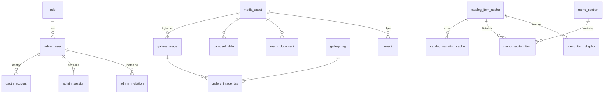

# TEAZO — Developer Guide

For the six of you who are not Juan. This is everything you need to get a working
database on your laptop, understand the schema, and build your feature. You will
never create a Cloudflare resource, never deploy, and never write a migration —
all of that lives in [`OPERATIONS.md`](./OPERATIONS.md), Juan's runbook (creating
the D1 databases and R2 buckets, deploying the Worker and the app, migrations,
backups and rollback, the go-live checklist, cost, and the Square production
cutover). [`DATA-MODEL.md`](./DATA-MODEL.md) explains *why* the schema looks like
this. This document explains *how to use it*.

**Source of truth for the schema is [`teazo-site/migrations/0001_init.sql`](../teazo-site/migrations/0001_init.sql).**
If this guide and that file disagree, the file wins — tell whoever wrote this.

| | |
|---|---|
| Hosting | **Vercel** — the app has no Cloudflare bindings |
| Database | Cloudflare D1 (SQLite) — 26 tables, 31 indexes, 6 triggers — reached through a proxy Worker |
| Object storage | Cloudflare R2 — bucket `teazo-media`, served from a custom domain |
| Catalog | Square API (authoritative — we cache it, we do not own it) |
| Status | Migrations and proxy Worker written and tested locally. **Nothing deployed yet.** |

None of that blocks you. Everything in this guide can be built against a local
database and a local R2, and it will work unchanged when the real ones exist.

---

## Contents

1. [Start here](#1-start-here)
2. [Local setup and the database client](#2-local-setup-and-the-database-client)
3. [The read path — getting data to the frontend](#3-the-read-path--getting-data-to-the-frontend)
4. [Object storage — how a file becomes a URL](#4-object-storage--how-a-file-becomes-a-url)
5. [Syncing Square into D1](#5-syncing-square-into-d1)
6. [Admin writes — the mutation contract](#6-admin-writes--the-mutation-contract)
7. [Auth and middleware](#7-auth-and-middleware)
8. [Asking for a schema change](#8-asking-for-a-schema-change)
9. [Table reference](#9-table-reference)
10. [Gotchas](#10-gotchas)
11. [Who builds what](#11-who-builds-what)

---

## 1. Start here

Read this section even if you skip the rest. It covers what credentials you
need (for most of you: none), the database you get to yourself, and the rules
for changing things other people depend on.

### 1.1 Credentials — most of you need none

This is the part people assume will block them. It does not.

| What you are building | Credentials you need |
|---|---|
| Public pages, admin screens, anything reading or writing the database | **None.** Local database, and a proxy token you make up. |
| Gallery uploads, media handling | **None** for local work — `wrangler dev` gives you a local R2 too. |
| Square sync, menu work | The **Square sandbox access token**. Ask Juan. |
| Deploying anything | You do not deploy. Juan does. |

So: unless you are touching Square, you can clone the repo and be productive
without waiting on anyone.

**When you do need a secret**, it comes from Juan directly through a password
manager or a DM — never in the repo, never pasted into a shared channel, never
in a commit message. If a token ever lands somewhere public, say so immediately
rather than quietly deleting the message; it has to be rotated either way.

`.env.local`, `.dev.vars`, and `.wrangler/` are all gitignored. Check before you
commit anyway:

```bash
git status --short
```

### 1.2 Your own sandbox database

**Yes — you get a private one, and it is the default.** `--local` creates a real
SQLite file under `teazo-d1-proxy/.wrangler/state/`. It is yours alone, it costs
nothing, it needs no Cloudflare account, and you can destroy it whenever you
like.

There are three databases, and one of them is yours:

| | What | Who touches it | When you use it |
|---|---|---|---|
| **Local** (`--local`) | a SQLite file on your laptop | only you | **all day, every day** |
| `teazo-db-preview` | shared remote D1 | the team | integration testing before a PR merges |
| `teazo-db` | production | the deploy process only | never directly |

Reset yours to a clean seeded state any time — this is a normal thing to do,
not a last resort:

```bash
cd teazo-d1-proxy && rm -rf .wrangler/state && npm run db:migrate:local
```

That gives you the full schema plus the seed data: roles, the real TEAZO address
and hours, social and delivery links, the ten menu sections, and the starter tag
vocabulary. Break it freely.

There is a separate sandbox one layer up: **Square's own sandbox catalog**,
which is what `SQUARE_ENV=sandbox` selects. The two are unrelated — your local
D1 is our data, Square's sandbox is their test catalog. Both are safe to
experiment in.

### 1.3 Working rules — can two people change the database at once?

Short answer: **yes for everyday work, no for schema changes.** The axis that
matters is *which database* and *schema vs data* — not which tables you touch.

**Everyday development: unlimited parallelism, zero coordination.** Every
developer has their own local database. Seven people can be inserting, deleting
and dropping rows at the same second and none of it collides, because none of it
is the same file. You never need to ask permission to work.

**Schema changes: one person, always Juan.** Not because of locking, but because
migrations are a shared, ordered, forward-only sequence. Wrangler records applied
migrations by filename. If two people both write `0003_…sql`, the two databases
diverge permanently and there is no revert command. So:

- Do not add files to `teazo-site/migrations/`.
- Do not edit a migration that already exists — it has already been applied
  somewhere, so editing it means the change never runs there.
- Ask for the schema change you need. It is fast.

**The shared preview database: several people at once is fine.** SQLite
serializes writes for you, so you cannot corrupt it by writing at the same
time. The real risk is duller — overwriting each other's test data and debugging
a ghost. Announce it in the channel before you do anything destructive there.

> The intuition that "multiple people are fine as long as they use different
> tables" is not the right model here. Concurrent *data* writes are safe on any
> table, because the engine handles them. Concurrent *migrations* are unsafe
> even on completely unrelated tables, because they share one numbered sequence.

**Production: nobody, ever, by hand.** Not `wrangler d1 execute --remote`, not
the dashboard console. Changes reach production through a migration Juan applies
and a deploy. If production data needs fixing, that is a migration too, so there
is a record of it.

### 1.4 The one rule

> **Square owns the catalog. D1 owns a copy plus the curation Square cannot express.**

Never make a D1 column the editable source of truth for something Square owns —
item names, prices, variations, category membership and ordering, modifier rules,
sold-out state, online visibility, store hours. If an admin can edit it in our UI
*and* in the Square dashboard, the website and the register will disagree in
front of a customer.

What D1 legitimately owns is in [§5.1](#51-what-we-cache-vs-what-we-own).

### 1.5 Where the app stands

Worth knowing before you pick something up — much less is wired than it looks:

| Surface | State |
|---|---|
| `/`, `/menu`, `/gallery`, `/contact`, `/delivery`, `/static-menu` | built, but every value is a hardcoded literal |
| `/menu` specifically | **787 lines** of mock items, ids like `mock-specials-…` that match nothing in Square |
| `/gallery` | 9 mock records that all point at the logo |
| `/login` | a shell — no `onSubmit`, no `onClick`, state goes nowhere |
| `/admin/gallery` | polished UI, **zero persistence** — uploads vanish on refresh |
| `/admin/menu` | really fetches Square; every mutation is a `console.log` |
| `/admin`, `/admin/events`, `/admin/settings`, `/admin/website-content` | `<h1>Hello World</h1>` |

There is no database client, no ORM and no storage SDK in the app today. You are
adding the first one.

---

## 2. Local setup and the database client

The app is hosted on **Vercel**. The database is still **Cloudflare D1** and the
object storage is still **Cloudflare R2**. Those are compatible, but not for
free: D1 is only reachable from inside a Worker, so we run one — `teazo-d1-proxy/`.
You run that Worker locally, against your own local D1, and the app talks to it
over HTTP exactly as it will in production.

### 2.1 The two projects in this repo

```
Teazo-Site/
├── teazo-site/            Next.js app  →  deployed to Vercel
│   ├── app/               where you work
│   └── migrations/        the D1 schema — read it, do not add to it (§8)
└── teazo-d1-proxy/        Cloudflare Worker  →  Juan deploys this
    ├── src/index.ts       /query, /batch, and the scheduled sweeper
    └── wrangler.jsonc     the only file in the repo with Cloudflare bindings
```

Almost all of your work is in `teazo-site/app/`. You run commands in
`teazo-d1-proxy/` only to start the local database and the proxy.

> **Never put Worker code inside `teazo-site/`.** That project's `tsconfig.json`
> has `"include": ["**/*.ts", …]` with only `node_modules` excluded, so any file
> using `D1Database` or `R2Bucket` types gets type-checked by `next build` and
> **fails the Vercel build**. That is why the Worker is a sibling directory, not
> a subdirectory.

### 2.2 First 20 minutes

> **Windows: clone to a short path.** `C:\dev\Teazo-Site` is fine;
> a deep path under `Documents\OneDrive\school\csc191\...` is not. Miniflare nests
> its local database several directories deep under `.wrangler/state/`, and once
> the total exceeds Windows' 260-character limit **every `wrangler d1` command
> fails with a bare `internal error` that says nothing about paths.** Verified:
> the same clone fails at a 200-character path and works at a 36-character one.

```bash
git clone https://github.com/W-Sammy/Teazo-Site.git
cd Teazo-Site
```

```bash
cd teazo-d1-proxy && npm install
```

```bash
npx wrangler d1 migrations apply teazo-db --local
```

```bash
npx wrangler d1 execute teazo-db --local --command "SELECT day_of_week, display_text FROM business_hours ORDER BY day_of_week;"
```

Seven rows, Monday through Sunday, ending `11:00 AM - 8:00 PM`. Now start the
proxy against that local database:

```bash
echo "PROXY_TOKEN=local-dev-token" > .dev.vars && npx wrangler dev --port 8787
```

In a second terminal, prove it answers:

```bash
curl -s http://127.0.0.1:8787/query -H "authorization: Bearer local-dev-token" -H 'content-type: application/json' -d '{"sql":"SELECT label FROM role ORDER BY id","params":[]}'
```

You should get `Owner`, `Can Edit`, `Can View`. Then point the app at it:

```bash
cd ../teazo-site && printf 'D1_PROXY_URL=http://127.0.0.1:8787\nPROXY_TOKEN=local-dev-token\n' > .env.local && npm install && npm run dev
```

### 2.3 Useful scripts

In `teazo-d1-proxy/package.json` (already there):

```bash
npm run dev                  # proxy against local D1
npm run dev:cron             # same, plus a triggerable scheduled handler
npm run db:migrate:local     # apply migrations to the local D1
npm run db:migrate:prod      # apply to the remote production D1
npm run db:backup            # wrangler d1 export -> backup.sql
npm run deploy               # ship the Worker
npm run tail                 # live logs from the deployed Worker
```

There is deliberately no unsuffixed `db:migrate`. `--local` and `--remote`
should never be one typo apart.

Of these, you use `dev`, `dev:cron` and `db:migrate:local`. The `:prod`,
`deploy`, `backup` and `tail` scripts are Juan's — see OPERATIONS.md.

### 2.4 Environment variables you need locally

All server-only. **Nothing here may be prefixed `NEXT_PUBLIC_`** except
`R2_PUBLIC_BASE`, which is a public hostname by definition.

Local dev uses `teazo-site/.env.local` for the app and
`teazo-d1-proxy/.dev.vars` for the Worker. Both are gitignored.

| Variable | Where | What |
|---|---|---|
| `D1_PROXY_URL` | `teazo-site/.env.local` | `http://127.0.0.1:8787` — your locally running proxy |
| `PROXY_TOKEN` | `teazo-site/.env.local` **and** `teazo-d1-proxy/.dev.vars` | same value both sides; locally it is one you make up, e.g. `local-dev-token` |
| `SQUARE_ACCESS_TOKEN` | `teazo-site/.env.local` | sandbox today — ask Juan |
| `SQUARE_ENV` | `teazo-site/.env.local` | `sandbox` \| `production` |

If you are doing media work you need nothing else: `wrangler dev` gives you a
local R2 too. The R2 variables the deployed app uses — `R2_ACCOUNT_ID`,
`R2_ACCESS_KEY_ID`, `R2_SECRET_ACCESS_KEY`, `R2_BUCKET_NAME` (`teazo-media`, also
written to `media_asset.r2_bucket`) and `R2_PUBLIC_BASE` (`https://media.teazosf.com`,
the R2 custom domain) — are set by Juan on Vercel. Ask him if you genuinely need
keys against the real bucket. Production and preview values, and the scoping
rules for them, are in OPERATIONS.md.

### 2.5 The client

`app/lib/d1.ts` keeps the same `prepare().bind().all()` ergonomics the rest of
this guide uses, so every SQL example works unchanged.

```ts
// teazo-site/app/lib/d1.ts
const URL_ = process.env.D1_PROXY_URL!;
const TOKEN = process.env.PROXY_TOKEN!;

type Stmt = { sql: string; params: unknown[] };
type D1Result<T> = { results: T[]; success: boolean; meta: { changes: number } };

async function post<T>(path: string, body: unknown): Promise<T> {
  const res = await fetch(`${URL_}${path}`, {
    method: "POST",
    headers: { authorization: `Bearer ${TOKEN}`, "content-type": "application/json" },
    body: JSON.stringify(body),
    cache: "no-store",
  });
  const json = await res.json();
  if (!res.ok) {
    // D1 constraint messages come through intact, which is what lets the
    // gallery delete handler recognise "media_asset is still referenced".
    throw new D1Error(json.message ?? json.error ?? res.statusText);
  }
  return json as T;
}

export class D1Error extends Error {}

/** Mirrors D1PreparedStatement closely enough that the SQL in this guide ports as-is. */
export function prepare(sql: string) {
  let params: unknown[] = [];
  const api = {
    bind(...p: unknown[]) { params = p; return api; },
    async all<T>() { return post<D1Result<T>>("/query", { sql, params }); },
    async first<T>() {
      const r = await post<D1Result<T>>("/query", { sql, params });
      return r.results[0] ?? null;
    },
    async run() { return post<D1Result<unknown>>("/query", { sql, params }); },
    toStmt(): Stmt { return { sql, params }; },
  };
  return api;
}

/** All-or-nothing. Send everything that must commit together in ONE call. */
export async function batch(stmts: Array<{ toStmt(): Stmt }>) {
  return post<{ results: unknown[] }>("/batch", {
    statements: stmts.map((s) => s.toStmt()),
  });
}
```

Usage is what you would expect:

```ts
import { prepare, batch } from "@/app/lib/d1";

const hours = await prepare(
  "SELECT day_of_week, display_text FROM business_hours ORDER BY day_of_week"
).all<BusinessHour>();

await batch([
  prepare("UPDATE admin_user SET deleted_at = strftime('%Y-%m-%dT%H:%M:%fZ','now') WHERE id = ?1").bind(id),
  prepare("UPDATE admin_session SET revoked_at = strftime('%Y-%m-%dT%H:%M:%fZ','now') WHERE admin_user_id = ?1 AND revoked_at IS NULL").bind(id),
]);
```

The proxy exposes exactly two endpoints, and the client above is the only thing
that should ever call them:

| | |
|---|---|
| `POST /query` | `{ sql, params }` → one statement, returns D1's `.all()` result |
| `POST /batch` | `{ statements: [{sql, params}] }` → `env.DB.batch()`, all-or-nothing |

**The proxy will run whatever the token-holder sends.** That is deliberate: the
only intended caller is our own Next.js server, which is exactly as trusted as
the database itself. The security property that matters is therefore *the token
never reaches the browser* — it is a server-only environment variable and must
never be named `NEXT_PUBLIC_*`. If you think a token has leaked, tell Juan;
rotating it is his job.

### 2.6 `/batch` is the only transaction

**`/batch` is the only transaction that exists.** D1 has no interactive
transactions, so anything that must be atomic has to travel as a single
`/batch` request. Splitting a logical transaction across two calls silently
gives up atomicity.

Practically, that means:

- Everything that must commit together goes into one `batch([...])` array — the
  upload route in [§4.4](#44-the-upload-route) and the delete-admin pair in
  [§6.3](#63-admins-settings) are the worked examples.
- A batch is all-or-nothing. The proxy caps it at `MAX_STATEMENTS = 40` and
  rejects anything larger with a clean `{"error":"too_many_statements"}` — that
  guard exists precisely so you never hit the free plan's 50-queries-per-invocation
  limit, which *would* fail partway. Chunk long work ([§5.4](#54-chunking-for-d1s-limits)).
- Statement order inside the batch matters when foreign keys or triggers are
  involved: parents before children, and the referencing row retired before the
  referenced one ([§4.8](#48-deletion--three-steps-in-this-order)).

### 2.7 The cost of the hop

Every database read is now Vercel → Worker → D1 instead of a local binding
call. Budget roughly 30–80 ms per round trip depending on regions, and design
around it:

- **Batch reads.** One `/batch` beats six `/query` calls.
- **Cache.** Public pages should set `export const revalidate = 300` — the menu
  and contact details change rarely, and this removes the hop from the hot path
  entirely.
- **Do not fan out per row.** The menu page reads sections and variations in two
  queries, never one query per item.

---

## 3. The read path — getting data to the frontend

Every public page currently renders from a TypeScript literal. This section
replaces each one.

### 3.1 A typed query helper

```ts
// app/lib/queries.ts
import { getDb } from "./db";

export type BusinessProfile = {
  business_name: string;
  street_address: string;
  locality: string;
  phone: string | null;
  email: string | null;
  map_query: string;
};

export type BusinessHour = {
  day_of_week: number;   // 0 = Monday
  display_text: string;
  is_closed: number;
};

export type SiteLink = {
  key: string;
  link_group: "social" | "delivery" | "other";
  label: string;
  url: string;
  aria_label: string | null;
  sort_order: number;
};

const DAY_LABELS = ["Monday","Tuesday","Wednesday","Thursday","Friday","Saturday","Sunday"];
export const dayLabel = (d: number) => DAY_LABELS[d];

export async function getBusinessProfile() {
  const db = await getDb();
  return db.prepare("SELECT * FROM business_profile WHERE id = 1").first<BusinessProfile>();
}

export async function getBusinessHours() {
  const db = await getDb();
  const { results } = await db
    .prepare("SELECT day_of_week, display_text, is_closed FROM business_hours ORDER BY day_of_week")
    .all<BusinessHour>();
  return results;
}

export async function getSiteLinks(group: "social" | "delivery") {
  const db = await getDb();
  const { results } = await db
    .prepare(`SELECT key, link_group, label, url, aria_label, sort_order
                FROM site_link
               WHERE link_group = ?1 AND is_active = 1
               ORDER BY sort_order, key`)
    .bind(group)
    .all<SiteLink>();
  return results;
}
```

### 3.2 Per-page queries

| Page | Replaces | Query |
|---|---|---|
| `/contact` | `contact-content.ts:22-41` | `getBusinessProfile()` + `getBusinessHours()` + `getSiteLinks('social')` |
| `/delivery` | `delivery/page.tsx:70-72` | `getSiteLinks('delivery')` + two `content_block` rows |
| `/` | `page.tsx:109-122`, `image-carousel.tsx:7-13` | `getSiteLinks('social')` + carousel query below |
| `/gallery` | `gallery/page.tsx:18-28` | gallery query below |
| `/menu` | `menu/page.tsx:80-700` | menu query in [§3.3](#33-the-menu-query) |
| `/static-menu` | `static-menu-content.tsx:57` | `menu_document WHERE is_current = 1` |

Carousel:

```sql
SELECT cs.id, cs.alt, cs.caption, cs.link_url, ma.id AS media_id
  FROM carousel_slide cs
  JOIN media_asset ma ON ma.id = cs.media_id AND ma.deleted_at IS NULL
 WHERE cs.is_active = 1
 ORDER BY cs.sort_order, cs.id;
```

Public gallery:

```sql
SELECT gi.id, gi.name, gi.caption, gi.alt, ma.id AS media_id
  FROM gallery_image gi
  JOIN media_asset ma ON ma.id = gi.media_id AND ma.deleted_at IS NULL
 WHERE gi.is_published = 1 AND gi.deleted_at IS NULL
 ORDER BY gi.sort_order, gi.id;
```

### 3.3 The menu query

This is the only complicated one. Four tables, and the orphan rule matters.

```sql
SELECT
  ms.id            AS section_id,
  ms.title         AS section_title,
  ms.subtitle      AS section_subtitle,
  ms.sort_order    AS section_order,
  ci.square_object_id,
  ci.name          AS item_name,
  ci.description,
  ci.square_image_url,
  msi.position,
  mid.badge,
  mid.is_featured,
  mid.image_media_id
FROM menu_section ms
JOIN menu_section_item msi
  ON msi.section_id = ms.id AND msi.square_env = ms.square_env
JOIN catalog_item_cache ci
  ON ci.square_object_id = msi.square_catalog_object_id
 AND ci.square_env       = msi.square_env
LEFT JOIN menu_item_display mid
  ON mid.square_catalog_object_id = ci.square_object_id
 AND mid.square_env              = ci.square_env
WHERE ms.square_env    = ?1          -- 'sandbox' | 'production'
  AND ms.is_published  = 1
  AND ci.is_deleted    = 0            -- orphan rule: never render a dead item
  AND COALESCE(mid.hide_on_website, 0) = 0
ORDER BY ms.sort_order, ms.id, msi.position, ci.square_object_id;
```

Prices come from the variation table — an item can have several (Regular, Large):

```sql
SELECT square_object_id, square_variation_id, name, price_cents, currency, is_sold_out
  FROM catalog_variation_cache
 WHERE square_env = ?1 AND square_object_id IN (/* chunked */)
 ORDER BY square_object_id, ordinal;
```

Run those as two queries and stitch in JS. Do not try to do it in one — you get
a row per item×variation and have to de-duplicate anyway.

> **`ORDER BY` always ends with a tiebreak column.** `sort_order` is not unique,
> and without `, id` SQLite may return equal rows in a different order between
> requests, so the page visibly reshuffles.

### 3.4 Caching

A D1 read in a server component makes the route **dynamic**, which kills the
static generation these pages have today. Pick deliberately per route:

```ts
export const revalidate = 300; // /menu, /gallery, /contact — content changes rarely
```

Use `revalidate` for public pages and full dynamic only for `/admin`.

---

## 4. Object storage — how a file becomes a URL

This is the part people get wrong, so read it before writing upload code.

R2 is reached two different ways depending on direction:

| Direction | Path | Credential |
|---|---|---|
| Write (upload, delete) | Vercel → `https://<account_id>.r2.cloudflarestorage.com`, S3 API | R2 access key id + secret |
| Read (every ``) | browser → `https://media.teazosf.com`, CDN-cached | none — public |

Reads never touch Vercel. That is the point.

### 4.1 The rule: the database stores a key, never a URL

`media_asset` has `r2_bucket` and `r2_key` and deliberately **no `url` column**.

A URL is a *derived* value. It depends on which bucket, which custom domain, and
which serving strategy — all of which change independently of the file. Store an
absolute URL and every row rots the day the domain changes. Store the key and
the URL is a pure function you can change in one place.

```
media_asset row                          rendered
┌─────────────────────────────────┐
│ id        6f2c…9a1              │──▶  https://media.teazosf.com/gallery/2026/09/x.webp
│ r2_bucket teazo-media           │
│ r2_key    gallery/2026/09/x.webp│
│ mime_type image/webp            │
│ byte_size 184320                │
└─────────────────────────────────┘
```

```ts
// app/lib/media.ts
const BASE = process.env.R2_PUBLIC_BASE!; // https://media.teazosf.com

export function toPublicUrl(asset: { r2_key: string }) {
  return `${BASE}/${asset.r2_key}`;
}
```

One function. Swap the domain, or move to signed URLs, and nothing else changes.

### 4.2 Key layout

```
gallery/{yyyy}/{mm}/{uuid}.{ext}
menu/items/{square_object_id}/{uuid}.{ext}
carousel/{uuid}.{ext}
events/{event_id}/{uuid}.{ext}
documents/menu/{uuid}.pdf
branding/{uuid}.{ext}
```

UUID keys, not content hashes. Dedupe-by-checksum is a feature nobody asked for
and it makes "delete then re-upload the same file" fail on a unique index.
Because keys are never reused, everything served from them is safely
immutable-cacheable.

Everything the gallery stores ends up `.webp`, because the upload route
re-encodes ([§4.4](#44-the-upload-route)). The other extensions exist for the
PDF menu and for assets migrated out of `public/`.

```ts
const EXT: Record<string, string> = {
  "image/jpeg": "jpg", "image/png": "png",
  "image/webp": "webp", "application/pdf": "pdf",
};

export function mintGalleryKey(mime: string, now = new Date()) {
  const yyyy = now.getUTCFullYear();
  const mm = String(now.getUTCMonth() + 1).padStart(2, "0");
  return `gallery/${yyyy}/${mm}/${crypto.randomUUID()}.${EXT[mime]}`;
}
```

### 4.3 The S3 client

Use [`aws4fetch`](https://github.com/mhart/aws4fetch) — about 5 KB, no AWS SDK.
`@aws-sdk/client-s3` also works and is heavier; pick it only if you need
multipart uploads.

```bash
npm install aws4fetch
```

```ts
// app/lib/r2.ts
import { AwsClient } from "aws4fetch";

export const r2 = new AwsClient({
  accessKeyId: process.env.R2_ACCESS_KEY_ID!,
  secretAccessKey: process.env.R2_SECRET_ACCESS_KEY!,
  service: "s3",
  region: "auto",              // R2 is always "auto"
});

export const r2Url = (key: string) =>
  `https://${process.env.R2_ACCOUNT_ID}.r2.cloudflarestorage.com/${process.env.R2_BUCKET_NAME}/${key}`;

export async function putObject(key: string, body: ArrayBuffer, contentType: string) {
  const res = await r2.fetch(r2Url(key), {
    method: "PUT",
    body,
    headers: { "content-type": contentType },
  });
  if (!res.ok) throw new Error(`R2 PUT failed: ${res.status} ${await res.text()}`);
}

export async function deleteObject(key: string) {
  const res = await r2.fetch(r2Url(key), { method: "DELETE" });
  // R2 DELETE is idempotent — 404 is success for our purposes.
  if (!res.ok && res.status !== 404) throw new Error(`R2 DELETE failed: ${res.status}`);
}
```

### 4.4 The upload route

> **Vercel caps a serverless function request body at 4.5 MB.** Our limit is
> 10 MB, so bytes cannot always go through the function. Two options:
>
> - **Proxy through the route** (below) — simple, and fine while uploads stay
>   under ~4 MB. Phone photos routinely exceed that.
> - **Presigned PUT** ([§4.5](#45-presigned-uploads-for-files-over-45-mb)) — the
>   browser uploads straight to R2 and only tells the server the key afterwards.
>
> Build the proxy version first because it is easier to get right, and switch
> when a real upload fails. Both write identical rows.

```ts
// app/api/admin/gallery/route.ts
import { prepare, batch } from "@/app/lib/d1";
import { putObject } from "@/app/lib/r2";
import { requireAdmin } from "@/app/lib/auth";
import { mintGalleryKey, sniffMime, normalizeTag, sortKey } from "@/app/lib/media";

import sharp from "sharp";

const MAX_BYTES = 10 * 1024 * 1024;   // what we accept from the browser
const ALLOWED = ["image/jpeg", "image/png", "image/webp"] as const;

export async function POST(request: Request) {
  const admin = await requireAdmin(request, 2); // role 2 = Can Edit
  if (!admin) return Response.json({ error: "Unauthorized" }, { status: 401 });

  const form = await request.formData();
  const file = form.get("file");
  const name = String(form.get("name") ?? "").trim();
  const tags = JSON.parse(String(form.get("tags") ?? "[]")) as string[];

  if (!(file instanceof File)) return Response.json({ error: "file required" }, { status: 400 });
  if (!name) return Response.json({ error: "name required" }, { status: 400 });

  const bytes = await file.arrayBuffer();
  if (bytes.byteLength === 0)       return Response.json({ error: "empty file" }, { status: 400 });
  if (bytes.byteLength > MAX_BYTES) return Response.json({ error: "file too large" }, { status: 413 });

  // Sniff magic bytes — never trust File.type, it is client-supplied.
  const mime = sniffMime(new Uint8Array(bytes.slice(0, 16)));
  if (!mime || !ALLOWED.includes(mime as typeof ALLOWED[number])) {
    return Response.json({ error: "unsupported image type" }, { status: 415 });
  }

  // Resize before storing. This is the single biggest lever on capacity:
  // straight-from-the-phone JPEGs average 1.6 MB, which fills the 10 GB free
  // allowance after ~6,400 photos. Re-encoded to webp at 2000px they average
  // well under 300 KB, which is ~35,000 photos. Capacity maths: OPERATIONS.md.
  // sharp is available on Vercel — this is one of the things that would NOT
  // work on Cloudflare Workers.
  const { data: resized, info } = await sharp(Buffer.from(bytes))
    .rotate()                                  // honour EXIF orientation
    .resize({ width: 2000, withoutEnlargement: true })
    .webp({ quality: 82 })
    .toBuffer({ resolveWithObject: true });

  const key = mintGalleryKey("image/webp");
  const mediaId = crypto.randomUUID();
  const imageId = crypto.randomUUID();

  // 1. Bytes first. If D1 fails after this we leak one object, which the
  //    sweeper cannot see but which costs nothing. If we wrote D1 first and R2
  //    failed, we would have a row pointing at nothing and a broken page.
  //    Leak over dangle, always.
  await putObject(key, resized.buffer as ArrayBuffer, "image/webp");

  // 2. Metadata, all-or-nothing, in ONE /batch — that is the only transaction.
  const stmts = [
    prepare(
      `INSERT INTO media_asset
         (id, r2_bucket, r2_key, mime_type, byte_size, original_filename, purpose, uploaded_by)
       VALUES (?1, ?2, ?3, ?4, ?5, ?6, 'gallery', ?7)`
    ).bind(mediaId, process.env.R2_BUCKET_NAME!, key, "image/webp", resized.byteLength, file.name, admin.admin_id),

    // width/height come free from sharp — store them so <Image> can set
    // dimensions without a layout shift.
    prepare("UPDATE media_asset SET width = ?2, height = ?3 WHERE id = ?1")
      .bind(mediaId, info.width, info.height),

    prepare(
      `INSERT INTO gallery_image (id, media_id, name, name_sort_key) VALUES (?1, ?2, ?3, ?4)`
    ).bind(imageId, mediaId, name, sortKey(name)),
  ];

  for (const raw of tags) {
    const norm = normalizeTag(raw);
    if (!norm) continue;
    stmts.push(
      prepare(
        `INSERT INTO gallery_tag (id, name, name_normalized) VALUES (?1, ?2, ?3)
         ON CONFLICT(name_normalized) DO NOTHING`
      ).bind(crypto.randomUUID(), raw.trim(), norm),
      prepare(
        `INSERT INTO gallery_image_tag (image_id, tag_id)
         SELECT ?1, id FROM gallery_tag WHERE name_normalized = ?2`
      ).bind(imageId, norm)
    );
  }

  await batch(stmts);

  return Response.json({ id: imageId, url: `${process.env.R2_PUBLIC_BASE}/${key}` }, { status: 201 });
}
```

Helpers:

```ts
// app/lib/media.ts
export const normalizeTag = (s: string) => s.trim().replace(/\s+/g, " ").toLowerCase();

// gallery_image.name_sort_key — SQLite's collations cannot reproduce
// localeCompare, and our content is bilingual. Compute the key at write time.
export const sortKey = (s: string) =>
  s.normalize("NFKD").replace(/\p{Diacritic}/gu, "").toLowerCase().trim();

export function sniffMime(head: Uint8Array): string | null {
  if (head[0] === 0xff && head[1] === 0xd8) return "image/jpeg";
  if (head[0] === 0x89 && head[1] === 0x50) return "image/png";
  if (head[0] === 0x25 && head[1] === 0x50) return "application/pdf";
  if (String.fromCharCode(...head.slice(0, 4)) === "RIFF" &&
      String.fromCharCode(...head.slice(8, 12)) === "WEBP") return "image/webp";
  return null;
}
```

The resize is not optional decoration — photo size is what decides how much the
bucket holds. Do not remove it.

### 4.5 Presigned uploads, for files over 4.5 MB

Two round trips, and the bytes never enter a Vercel function.

```ts
// app/api/admin/gallery/presign/route.ts
export async function POST(request: Request) {
  const admin = await requireAdmin(request, 2);
  if (!admin) return Response.json({ error: "Unauthorized" }, { status: 401 });

  const { mime } = await request.json();
  if (!ALLOWED.includes(mime)) return Response.json({ error: "unsupported" }, { status: 415 });

  const key = mintGalleryKey(mime);
  const signed = await r2.sign(
    new Request(r2Url(key), { method: "PUT", headers: { "content-type": mime } }),
    { aws: { signQuery: true }, headers: { "x-amz-expires": "600" } } // 10 minutes
  );

  return Response.json({ uploadUrl: signed.url, key });
}
```

The browser `PUT`s the file to `uploadUrl`, then posts `{ key, name, tags }` to
a second route that does only the `batch()` from §4.4. That second route
**must re-validate**: `HEAD` the object to confirm it exists and read its real
size and content type from R2 rather than trusting the client.

### 4.6 Where the images come from

Every `` reads from `https://media.teazosf.com` — the R2 custom domain,
CDN-cached, no credential, never through Vercel. **It is already set up for
you:** attaching the custom domain to the bucket and adding the Cache Everything
rule are Juan's — see OPERATIONS.md. All you do is build the URL with
`toPublicUrl()` ([§4.1](#41-the-rule-the-database-stores-a-key-never-a-url)).

> **Do not use the `r2.dev` subdomain.** Cloudflare states it is
> "rate-limited and should only be used for development purposes", and it
> cannot use WAF rules, caching, or access controls. It must never appear in
> `R2_PUBLIC_BASE`.

There is deliberately no `/api/media/[id]` route. Serving from the domain is
strictly better: no function invocation, no D1 lookup, and CDN caching on every
read.

### 4.7 `next/image`

Vercel runs the full Next.js image optimizer (`sharp` is available), so
`<Image>` works normally — resizing, WebP conversion, and `srcset` all included.

`next.config.ts` builds `remotePatterns` from `app/lib/imageHosts.ts`, which
today allowlists only the Square **sandbox** bucket. It needs the R2 domain,
and it will need the Square production host at cutover:

```ts
// teazo-site/app/lib/imageHosts.ts
export const allowedHosts = [
  "media.teazosf.com",                              // R2 custom domain — our own media
  "items-images-sandbox.s3.us-west-2.amazonaws.com", // Square sandbox
  // "items-images-production.s3.us-west-2.amazonaws.com", // add at cutover — §5.7
];
```

(The cutover that comment refers to is Juan's — see OPERATIONS.md.)

Miss this and every `<Image>` of our own media fails with an "hostname is not
configured" error at runtime, not at build time.

> `public/carousel_images/dried_leaves.jpg` is **8.1 MB**. The optimizer will
> serve a resized derivative, but it still has to fetch and process the
> original on the first request. Those originals get resized when the existing
> `public/` assets move into R2 — Juan runs that migration, see OPERATIONS.md.

### 4.8 Deletion — three steps, in this order

Media is **soft**-deleted, and a database trigger refuses to soft-delete a file
that is still referenced by a gallery image, carousel slide, menu document,
content block, site link, event flyer, menu item photo, or admin avatar.

Check usage first so you can return a helpful error rather than surfacing a raw
constraint failure:

```ts
const inUse = await prepare(
  `SELECT 'gallery' AS t FROM gallery_image      WHERE media_id = ?1 AND deleted_at IS NULL
   UNION ALL SELECT 'carousel' FROM carousel_slide WHERE media_id = ?1
   UNION ALL SELECT 'menu_pdf' FROM menu_document  WHERE media_id = ?1
   UNION ALL SELECT 'content'  FROM content_block  WHERE media_id = ?1
   UNION ALL SELECT 'link'     FROM site_link      WHERE icon_media_id = ?1
   UNION ALL SELECT 'event'    FROM event          WHERE flyer_media_id = ?1 AND deleted_at IS NULL
   UNION ALL SELECT 'menu_item' FROM menu_item_display WHERE image_media_id = ?1
   LIMIT 1`
).bind(mediaId).first<{ t: string }>();

if (inUse) {
  return Response.json({ error: "still_in_use", usedBy: inUse.t }, { status: 409 });
}

await batch([
  // The gallery row is retired BEFORE the media row, or the trigger fires.
  prepare("UPDATE gallery_image SET deleted_at = strftime('%Y-%m-%dT%H:%M:%fZ','now') WHERE id = ?1").bind(imageId),
  prepare("UPDATE media_asset  SET deleted_at = strftime('%Y-%m-%dT%H:%M:%fZ','now') WHERE id = ?1").bind(mediaId),
  prepare("INSERT INTO pending_r2_deletion (r2_bucket, r2_key) VALUES (?1, ?2)").bind(bucket, key),
]);
```

Bytes are **not** deleted here. A sweeper running in the proxy Worker drains
`pending_r2_deletion` after a 24-hour grace period, and that gap is the only
undo window the media pipeline has. The sweeper is Juan's to deploy and run —
see OPERATIONS.md. Once it has run, the bytes are gone: R2 has no versioning.

Because the app catches `D1Error` and reads its message, a trigger firing
anyway (a race, a missed usage check) still produces a sensible 409 rather than
a 500.

---

## 5. Syncing Square into D1

### 5.1 What we cache vs what we own

| Square owns (cache only, never edit) | D1 owns (edit freely) |
|---|---|
| item name, description | section titles & subtitles |
| variations, prices, currency | the synthetic "TEAZO Special" section |
| category membership + `ordinal` | display `position` within a section |
| modifier lists, selection rules | local photo override, badges, featured |
| sold-out state, online visibility | allergen notes, hide-on-website |
| item images | everything non-catalog |

### 5.2 Prerequisite: fix the variations bug first

`PUT /api/square/products/[id]` (lines 90-104) rewrites `itemData.variations` to
a **single element named "Regular"**. `POST` does the same. Every admin edit
silently deletes all but the first size.

For a boba shop, sizes *are* the variations. **Do not build the sync until this
is fixed**, or the cache faithfully mirrors data corruption. The corrected
handler must read all variations, preserve each one's `id` and `version`, and
send them all back:

```ts
const currentVariations = (currentItem.itemData?.variations ?? []) as CatalogObject.ItemVariation[];

variations: currentVariations.map((v) => ({
  type: "ITEM_VARIATION" as const,
  id: v.id,
  version: v.version,
  itemVariationData: {
    ...v.itemVariationData,
    // apply only the edits the request actually asked for
  },
})),
```

Also **remove the `BigInt.prototype.toJSON` monkey-patch** in
`app/lib/square.ts:12-21`. It is a global side effect of an import, it is lossy,
and every price passes through it. Convert explicitly instead:

```ts
const toInt = (v?: bigint | number | null) => (v == null ? null : Number(v));
```

### 5.3 Full sync

```ts
// app/lib/square-sync.ts
import { prepare, batch } from "@/app/lib/d1";

export async function fullSync() {
  const sqEnv = process.env.SQUARE_ENV!; // 'sandbox' | 'production'
  const items = squareClient.catalog.list({ types: "ITEM" });

  const itemStmts = [];
  const varStmts = [];

  for await (const obj of items) {
    const item = obj as CatalogObject.Item;
    if (!item.id) continue;

    itemStmts.push(prepare(
      `INSERT INTO catalog_item_cache
         (square_object_id, square_env, square_version, name, description,
          square_image_url, categories_json, is_deleted, synced_at)
       VALUES (?1,?2,?3,?4,?5,?6,?7,0, strftime('%Y-%m-%dT%H:%M:%fZ','now'))
       ON CONFLICT(square_object_id, square_env) DO UPDATE SET
         square_version   = excluded.square_version,
         name             = excluded.name,
         description      = excluded.description,
         square_image_url = excluded.square_image_url,
         categories_json  = excluded.categories_json,
         is_deleted       = 0,
         synced_at        = excluded.synced_at`
    ).bind(
      item.id, sqEnv, toInt(item.version),
      item.itemData?.name ?? null,
      item.itemData?.description ?? null,
      null,
      JSON.stringify((item.itemData?.categories ?? []).map((c) => ({ id: c.id, ordinal: toInt(c.ordinal) })))
    ));

    // EVERY variation, not just [0].
    for (const v of (item.itemData?.variations ?? []) as CatalogObject.ItemVariation[]) {
      if (!v.id) continue;
      const money = v.itemVariationData?.priceMoney;
      varStmts.push(prepare(
        `INSERT INTO catalog_variation_cache
           (square_variation_id, square_env, square_object_id, square_version,
            name, price_cents, currency, ordinal, synced_at)
         VALUES (?1,?2,?3,?4,?5,?6,?7,?8, strftime('%Y-%m-%dT%H:%M:%fZ','now'))
         ON CONFLICT(square_variation_id, square_env) DO UPDATE SET
           name = excluded.name, price_cents = excluded.price_cents,
           currency = excluded.currency, ordinal = excluded.ordinal,
           synced_at = excluded.synced_at`
      ).bind(
        v.id, sqEnv, item.id, toInt(v.version),
        v.itemVariationData?.name ?? null,
        toInt(money?.amount), money?.currency ?? "USD",
        toInt(v.itemVariationData?.ordinal) ?? 0
      ));
    }
  }

  // Items before variations — the FK depends on the parent existing.
  // Each chunk is one /batch request, so each chunk is one transaction.
  for (const c of chunk(itemStmts, 20)) await batch(c);
  for (const c of chunk(varStmts, 20)) await batch(c);
}
```

### 5.4 Chunking for D1's limits

D1 allows ~100 bound parameters per statement. `catalog_item_cache` binds 7 per
row, so a batch of 20 statements is comfortably inside the limit with room for
the variation table's 8. Do not raise this above ~30 without measuring.

```ts
const chunk = <T,>(a: T[], n: number) =>
  Array.from({ length: Math.ceil(a.length / n) }, (_, i) => a.slice(i * n, i * n + n));
```

### 5.5 Delta sync and webhooks

Square emits exactly **one** catalog webhook, `catalog.version.updated`, and its
payload carries only the merchant's new catalog version — **it does not say which
objects changed.** So there is no object-level delta to key on. The design is:

1. Webhook arrives → verify the signature → read the new version.
2. Compare to `square_sync_state.last_catalog_version` for this `square_env`.
3. If newer, run a delta scan with `SearchCatalogObjects`, passing `beginTime`
   = `last_synced_at` and `includeDeletedObjects: true`.
4. Upsert live objects; mark returned tombstones `is_deleted = 1`.
5. Write the new watermark.

```ts
await prepare(
  `INSERT INTO square_sync_state (key, square_env, last_catalog_version, last_synced_at)
   VALUES ('catalog', ?1, ?2, strftime('%Y-%m-%dT%H:%M:%fZ','now'))
   ON CONFLICT(key, square_env) DO UPDATE SET
     last_catalog_version = excluded.last_catalog_version,
     last_synced_at       = excluded.last_synced_at,
     last_error           = NULL`
).bind(sqEnv, newVersion).run();
```

### 5.6 Deletes and orphans

`DELETE /api/square/products/[id]` returns `deletedObjectIds` and currently
**consumes it nowhere**. It must mark the cache:

```ts
await batch(
  deletedObjectIds.map((id) =>
    prepare(
      "UPDATE catalog_item_cache SET is_deleted = 1 WHERE square_object_id = ?1 AND square_env = ?2"
    ).bind(id, sqEnv)
  )
);
```

Never hard-delete a cache row: `menu_section_item` and `menu_item_display`
reference it with `ON DELETE RESTRICT`, so `is_deleted` is the tombstone. The
menu query already filters `ci.is_deleted = 0`, so the item disappears from the
public page while the admin's curation survives if Square restores it.

> **A re-created Square item gets a new id**, so its curation is lost. That is
> inherent to keying on Square ids, and worth telling the client.

Build everything against `SQUARE_ENV=sandbox`. Moving the site onto the real
production catalog is a separate, manual piece of work Juan runs — see
OPERATIONS.md. It matters to you only in that curation you build now is keyed to
sandbox object ids.

---

## 6. Admin writes — the mutation contract

Every route below requires a valid session ([§7](#7-auth-and-middleware)).
Roles are `1 = Owner`, `2 = Can Edit`, `3 = Can View` — matching
`ADMIN_ROLE_LABELS` on the `steven-create-admins` branch.

### 6.1 Gallery

| Method | Path | Role | Effect |
|---|---|---|---|
| `GET` | `/api/admin/gallery` | 3 | list with search/tag filter/sort |
| `POST` | `/api/admin/gallery` | 2 | upload — see [§4.4](#44-the-upload-route) |
| `PATCH` | `/api/admin/gallery/[id]` | 2 | rename, caption, alt, tags, publish |
| `DELETE` | `/api/admin/gallery/[id]` | 2 | soft-delete — see [§4.8](#48-deletion--three-steps-in-this-order) |

The list query mirrors what `admin-gallery-client.tsx` does today —
case-insensitive substring over **name and tags**, OR-semantics tag filter:

```sql
SELECT gi.*, ma.r2_key
  FROM gallery_image gi
  JOIN media_asset ma ON ma.id = gi.media_id
 WHERE gi.deleted_at IS NULL
   AND (?1 = '' OR lower(gi.name) LIKE '%' || lower(?1) || '%'
        OR EXISTS (SELECT 1 FROM gallery_image_tag git
                     JOIN gallery_tag gt ON gt.id = git.tag_id
                    WHERE git.image_id = gi.id
                      AND gt.name_normalized LIKE '%' || lower(?1) || '%'))
 ORDER BY gi.name_sort_key;   -- or created_at DESC, per the sort dropdown
```

`LIKE '%x%'` cannot use an index. At this table's size a scan is fine; if the
gallery grows past a few thousand rows, switch to FTS5.

**Renaming must recompute `name_sort_key`.** It is `NOT NULL` and the UI sorts
on it; forget this and the sort order silently stops matching the names.

### 6.2 Tag handling

Tags are a shared vocabulary with `name_normalized UNIQUE`. Always upsert:

```sql
INSERT INTO gallery_tag (id, name, name_normalized) VALUES (?1, ?2, ?3)
ON CONFLICT(name_normalized) DO NOTHING;

INSERT INTO gallery_image_tag (image_id, tag_id)
SELECT ?1, id FROM gallery_tag WHERE name_normalized = ?2
ON CONFLICT DO NOTHING;
```

This is what stops "Matcha" and "matcha" becoming two sidebar entries — the
current `normalizeTag` in `gallery-upload-form.tsx:31-33` trims and collapses
whitespace but does **not** lowercase.

### 6.3 Admins (Settings)

Matches the stub API on `steven-create-admins`
(`app/api/admin/settings/admins-api.ts`), which currently throws on every call.

| Method | Path | Role | Notes |
|---|---|---|---|
| `GET` | `/api/admin/settings/admins` | 1 | list |
| `POST` | `/api/admin/settings/admins` | 1 | create + invite |
| `PATCH` | `/api/admin/settings/admins/[id]/role` | 1 | change role |
| `PATCH` | `/api/admin/settings/admins/[id]/invite-permission` | 1 | toggle `can_invite_users` |
| `DELETE` | `/api/admin/settings/admins/[id]` | 1 | soft-delete + revoke sessions |

Rules the schema enforces, matching `use-admins.ts`:

- `can_invite_users = 1` is **only** valid for role 2. A CHECK constraint rejects
  anything else, so changing a role to 1 or 3 must clear the flag in the same
  statement.
- At most one Owner — a partial unique index. "At least one Owner" is **not**
  expressible in SQLite; your handler must refuse to delete or demote the last
  one (`use-admins.ts:21, :53-56`).
- `email_normalized` is unique among live rows. Normalize with
  `email.trim().toLowerCase()` — `addAdmin` currently does no duplicate check at
  all.

**Deleting an admin must revoke their sessions in the same batch.** The FK is
`ON DELETE CASCADE`, but we soft-delete, so the cascade never fires:

```ts
await batch([
  prepare("UPDATE admin_user SET deleted_at = strftime('%Y-%m-%dT%H:%M:%fZ','now') WHERE id = ?1").bind(id),
  prepare("UPDATE admin_session SET revoked_at = strftime('%Y-%m-%dT%H:%M:%fZ','now') WHERE admin_user_id = ?1 AND revoked_at IS NULL").bind(id),
]);
```

### 6.4 Website content

| Method | Path | Role | Effect |
|---|---|---|---|
| `GET` | `/api/admin/content` | 3 | all blocks grouped by `page_key` |
| `PUT` | `/api/admin/content/[key]` | 2 | update one block |

`content_block.key` **must** equal `page_key || '.' || slot_key` — a CHECK
enforces it. Build the key, do not accept it from the client.

### 6.5 Menu curation

| Method | Path | Role | Effect |
|---|---|---|---|
| `PUT` | `/api/admin/menu/sections/[id]` | 2 | title, subtitle, order, publish |
| `PUT` | `/api/admin/menu/sections/[id]/items` | 2 | membership + `position` |
| `PUT` | `/api/admin/menu/items/[squareId]/display` | 2 | photo, badge, featured, hide |

These replace the `console.log` stubs in `admin-list-view.tsx:127-132`. Note the
overlay upsert must supply `square_env`:

```sql
INSERT INTO menu_item_display
  (square_catalog_object_id, square_env, image_media_id, badge, is_featured, updated_by)
VALUES (?1, ?2, ?3, ?4, ?5, ?6)
ON CONFLICT(square_catalog_object_id, square_env) DO UPDATE SET
  image_media_id = excluded.image_media_id,
  badge          = excluded.badge,
  is_featured    = excluded.is_featured,
  updated_by     = excluded.updated_by;
```

### 6.6 Events, hours, links, contact inbox

| Method | Path | Role |
|---|---|---|
| `GET/POST` `/api/admin/events`, `PUT/DELETE` `/api/admin/events/[id]` | 2 |
| `PUT` `/api/admin/hours` (bulk, 7 rows) | 2 |
| `POST/DELETE` `/api/admin/hours/exceptions` | 2 |
| `GET/PUT` `/api/admin/links` | 2 |
| `GET` `/api/admin/messages`, `PATCH` `/api/admin/messages/[id]` (mark read) | 3 |
| `POST` `/api/contact` | **public** |

`POST /api/contact` is the only route an unauthenticated visitor can write to.
Rate-limit it and cap field lengths — the table has no length constraints.

---

## 7. Auth and middleware

> **This is a live hole today.** There is no `middleware.ts` anywhere in the
> repo, `app/admin/layout.tsx` is pure presentation with no guard, and
> `POST`/`PUT`/`DELETE` on `/api/square/products` are unauthenticated routes that
> **write to the live Square catalog**. Anyone who knows the URLs can use them.
> Fix this in the same sprint as the tables.

### 7.1 Session validation

```ts
// app/lib/auth.ts
import { prepare } from "@/app/lib/d1";

export async function getSession(request: Request) {
  const token = parseCookie(request.headers.get("cookie"), "teazo_session");
  if (!token) return null;

  const id = await sha256Hex(token);

  // Joining admin_user and requiring active/undeleted means a missed
  // revocation still fails closed.
  return prepare(
    `SELECT s.id, au.id AS admin_id, au.display_name, au.role_id, au.can_invite_users
       FROM admin_session s
       JOIN admin_user au ON au.id = s.admin_user_id
      WHERE s.id = ?1
        AND s.revoked_at IS NULL
        AND s.expires_at > strftime('%Y-%m-%dT%H:%M:%fZ','now')
        AND au.deleted_at IS NULL
        AND au.status = 'active'`
  ).bind(id).first<SessionRow>();
}

/** minRole: 1 = Owner, 2 = Can Edit, 3 = Can View. Lower id = more privilege. */
export async function requireAdmin(request: Request, minRole: 1 | 2 | 3) {
  const s = await getSession(request);
  return s && s.role_id <= minRole ? s : null;
}
```

Store only the **SHA-256 of the cookie value** as `admin_session.id`. A database
read never yields a usable token.

### 7.2 Middleware

```ts
// teazo-site/middleware.ts
import { NextResponse, type NextRequest } from "next/server";

export function middleware(req: NextRequest) {
  if (!req.cookies.get("teazo_session")) {
    return NextResponse.redirect(new URL("/login", req.url));
  }
  return NextResponse.next();
}

export const config = { matcher: ["/admin/:path*"] };
```

Middleware only checks that a cookie *exists* — it is a cheap redirect, not
authorization. **Every admin route handler must still call `requireAdmin`.**

### 7.3 Google SSO

`login/page.tsx` is an inert shell: the form has no `onSubmit`, the Google button
has no `onClick`, and the email/password state is never transmitted. The
`oauth_account` table stores **only** `provider` + `provider_account_id` (the
Google `sub`) — no access or refresh tokens, because the app never calls a Google
API on the user's behalf and D1 has no column-level encryption.

Sign-in flow: Google returns `sub` → look up `oauth_account` → if none, check
`admin_invitation` for a live invite matching the verified email → create
`admin_user` + `oauth_account`, mark the invite accepted → mint a session.

**No self-registration.** A Google account with no invite and no existing
`admin_user` gets rejected.

---

## 8. Asking for a schema change

You will hit a column that does not exist. That is expected, and the fix is a
message to Juan, not a file.

**Do not:**

- Add a file to `teazo-site/migrations/`. Wrangler records applied migrations by
  filename; two people writing `0003_…sql` diverges the databases permanently and
  there is no revert command.
- Edit a migration that already exists. It has already been applied somewhere, so
  editing it means the change never runs there and environments silently diverge.
- Run anything against production or the shared preview database by hand.

**Do:** ask. It is usually a five-minute change, and going through one person is
what keeps everyone's database identical. Include:

- **The table** — the existing one it goes on, or the name you want for a new one.
- **The columns** — name, type (`TEXT`/`INTEGER`/no `BOOLEAN`, no `ENUM`), nullable
  or not, default, and any `CHECK` or foreign key it needs.
- **What reads it** — the page or route, and roughly the query, so the index
  question can be answered at the same time.
- **What writes it** — which admin screen or sync path, and whether it has to be
  atomic with anything else (that decides whether it lands in one `/batch`).

Two things worth knowing before you ask, because they change how big the request
is:

- **Additive is cheap.** A new table, a new index, a **nullable** column or a
  trigger can ship before the app that uses it — the old app ignores what it does
  not know about.
- **Tightening is not.** Dropping or renaming a column, or adding `NOT NULL`,
  takes two separate deploys, because the outgoing app version is still writing
  that column while it drains. A rename is three phases. Adding a `CHECK` or a
  `FOREIGN KEY` is harder still — SQLite's `ALTER TABLE` cannot do it at all, so
  it needs a full 12-step table rebuild. Ask early for any of these.

Juan applies the migration and tells you when it has landed; you then re-run
`npm run db:migrate:local` (or reset, [§1.2](#12-your-own-sandbox-database)) to
pick it up. The deploy sequencing is his — see OPERATIONS.md.

---

## 9. Table reference



| Table | Purpose | Written by | Read by |
|---|---|---|---|
| `role` | 1 Owner / 2 Can Edit / 3 Can View | seed | auth |
| `admin_user` | admin accounts | Settings | auth, every admin route |
| `oauth_account` | Google `sub` → admin | login flow | login flow |
| `admin_session` | live sessions (hashed token) | login, logout, delete-admin | middleware |
| `admin_invitation` | pending invites | Settings | login flow |
| `media_asset` | R2 object metadata | uploads | every image render |
| `pending_r2_deletion` | bytes awaiting reap | delete handlers | cron Worker |
| `gallery_image` | gallery entries | `/admin/gallery` | `/gallery` |
| `gallery_tag` | tag vocabulary | tag upsert | filter sidebar |
| `gallery_image_tag` | image↔tag join | tag upsert | filter |
| `business_profile` | address, phone, email (singleton) | Settings | `/contact`, footer |
| `business_hours` | 7 weekday rows | Settings | `/contact` |
| `hours_exception` | holiday closures | Settings | `/contact` |
| `site_link` | social + delivery URLs | Settings | `/`, `/contact`, `/delivery` |
| `content_block` | editable copy | Website Content | all public pages |
| `carousel_slide` | home carousel | Website Content | `/` |
| `menu_document` | versioned PDF menu | Website Content | `/static-menu` |
| `square_sync_state` | per-env sync watermark | sync | sync |
| `catalog_item_cache` | Square items (cache) | sync | `/menu`, `/admin/menu` |
| `catalog_variation_cache` | **sizes and prices** | sync | `/menu` |
| `catalog_category_cache` | Square categories (cache) | sync | section liveness |
| `menu_section` | menu sections + subtitles | `/admin/menu` | `/menu` |
| `menu_section_item` | section membership + order | `/admin/menu` | `/menu` |
| `menu_item_display` | photo, badge, featured | `/admin/menu` | `/menu` |
| `event` | events | `/admin/events` | future events page |
| `contact_message` | inquiries | **public** contact form | admin inbox |

### Columns whose purpose is not obvious

Do not drop these — each fixes a specific bug.

| Column | Why |
|---|---|
| `square_env` | sandbox and production Square catalogs share **no** object ids. Without it in the key, cutover orphans every curation row. |
| `square_version` | Square's optimistic-concurrency token. Without it you cannot tell whether a cached price is stale, and a stale price is a customer-facing error. |
| `name_sort_key` | SQLite has only BINARY/NOCASE/RTRIM collations; none reproduce the `localeCompare` order the admin sorts by, and the content is bilingual. |
| `email_normalized` | `NOCASE` folds ASCII only. |
| `name_normalized` | stops "Matcha" and "matcha" becoming two tags. |
| `can_invite_users` | per-admin flag, valid only for role 2 — enforced by CHECK. |
| `is_current` | partial unique index → exactly one live menu PDF. |
| `square_ordinal` | Square's order at last sync; **seeds** `position`, then drift is visible rather than silent. |
| `pending_r2_deletion` | D1 has no TTL and R2 deletes are not transactional with D1. |

---

## 10. Gotchas

**Environment**

- **Windows: keep the repo path short.** Past ~260 characters total, miniflare's
  nested state directory blows the `MAX_PATH` limit and every `wrangler d1`
  command dies with an unexplained `internal error`. Clone to `C:\dev\`.

**SQLite / D1**

- Only `INTEGER PRIMARY KEY` implies `NOT NULL`. Every `TEXT` PK here is
  explicitly `NOT NULL` — keep it that way, or a helper returning `undefined`
  writes a row you can never look up again.
- No `BOOLEAN` (use `INTEGER 0/1`), no `ENUM` (use `CHECK`), no `JSONB`
  (use `TEXT` + `json_valid()`), no `UUID`.
- **`ALTER TABLE` cannot add a `CHECK` or a `FOREIGN KEY`** without a full
  12-step table rebuild. That is why they are all declared up front.
- `db.batch()` is the only transaction primitive. No interactive transactions.
- ~100 bound parameters and ~100 KB per statement.
- Always end `ORDER BY` with a unique tiebreak column.

**This schema specifically**

- Media is **soft**-deleted, so `ON DELETE RESTRICT` never fires on retirement —
  a trigger does the protecting. Check usage first so you can return a 409.
- Deleting an admin does **not** revoke sessions automatically. Batch it.
- `updated_at` triggers are scoped `AFTER UPDATE OF <content columns>` on
  purpose. Do not rewrite them as a bare `AFTER UPDATE ... WHEN NEW.updated_at =
  OLD.updated_at` — that recurses to the trigger-depth limit when two writes land
  in the same millisecond.
- `business_hours.day_of_week` is **0 = Monday**. JavaScript's `getDay()` is
  0 = Sunday. Convert at the boundary.
- **Timestamps are not comparable across formats.** Every column is written with
  `strftime('%Y-%m-%dT%H:%M:%fZ','now')`. Comparing one against
  `datetime('now', …)` compares `'2026-09-08T…'` with `'2026-09-08 …'` as
  strings, and `'T'` sorts above `' '`, so the answer is silently wrong rather
  than an error. Build both sides with the same `strftime`.
- **`ux_invitation_pending` ignores `expires_at`.** A lapsed invitation still
  holds its email's unique slot, so re-inviting that address fails with a
  constraint error until the sweeper stamps `revoked_at`. This is a fourth
  correctness story that depends on the sweeper running.

**Free-tier limits**

- `MAX_STATEMENTS = 40` and `REAP_LIMIT = 20` in the proxy exist to stay under
  the free plan's 50 D1-queries-per-invocation and 50-subrequests-per-request
  caps. Raising either quietly moves the project onto a paid plan.
- Exceeding a *daily* D1 limit stops queries rather than billing you — the site
  breaks instead of surprising anyone with an invoice.

**Vercel + proxy**

- `/batch` is the only transaction. Anything that must be atomic travels in one
  `/batch` call; splitting it across two requests silently gives up atomicity.
- The proxy token must never be `NEXT_PUBLIC_*`. It grants full SQL access.
- Scope every Vercel environment variable to Production or Preview, or PR
  previews will write to the production database.
- Vercel caps a function request body at 4.5 MB, below our 10 MB upload limit —
  see [§4.5](#45-presigned-uploads-for-files-over-45-mb).

**Square**

- Fix the `variations[0]` truncation before syncing.
- Remove the `BigInt.prototype.toJSON` monkey-patch; convert explicitly.
- `catalog.version.updated` is the only catalog webhook and carries no
  object-level delta.
- The client is pinned to Sandbox. Read `env.SQUARE_ENV` instead.

---

## 11. Who builds what

Ordered by what is broken now, not by what is architecturally tidy. Each slice
is roughly one sprint for one developer and closes a real defect.

| # | Slice | Fixes | Sections |
|---|---|---|---|
| 1 | Media + gallery + R2 | uploads vanish on refresh | [§4](#4-object-storage--how-a-file-becomes-a-url), [§6.1](#61-gallery) |
| 2 | Auth + middleware | `/admin` and the Square write routes are open to the internet | [§7](#7-auth-and-middleware), [§6.3](#63-admins-settings) |
| 3 | Contact form | the `mailto:` form silently loses every inquiry | [§6.6](#66-events-hours-links-contact-inbox) |
| 4 | Site content | Karen can edit the site without a deploy | [§3](#3-the-read-path--getting-data-to-the-frontend), [§6.4](#64-website-content) |
| 5 | Square sync + menu | replaces the 787-line mock menu | [§5](#5-syncing-square-into-d1), [§6.5](#65-menu-curation) |
| 6 | Events | `/admin/events` has nothing to read | [§6.6](#66-events-hours-links-contact-inbox) |
| 0 | **Proxy Worker + sweeper** | nothing can reach the database without it | Juan's — OPERATIONS.md |

Slice 5 depends on the variations fix in [§5.2](#52-prerequisite-fix-the-variations-bug-first).
The sweeper is small but unowned — give it to someone.

### Still to decide

1. **Hours** — Square Locations or D1? Both can hold them; pick a direction.
2. **Menu photos** — the 65 local `.webp`, or Square's hosted images? The schema
   assumes local via `menu_item_display.image_media_id`.
3. **Cutover date** — curation built before it is keyed to sandbox ids.
4. **Alt text / captions** — the upload form collects only `{name, tags, file}`.
   Add the inputs, or accept nulls.
